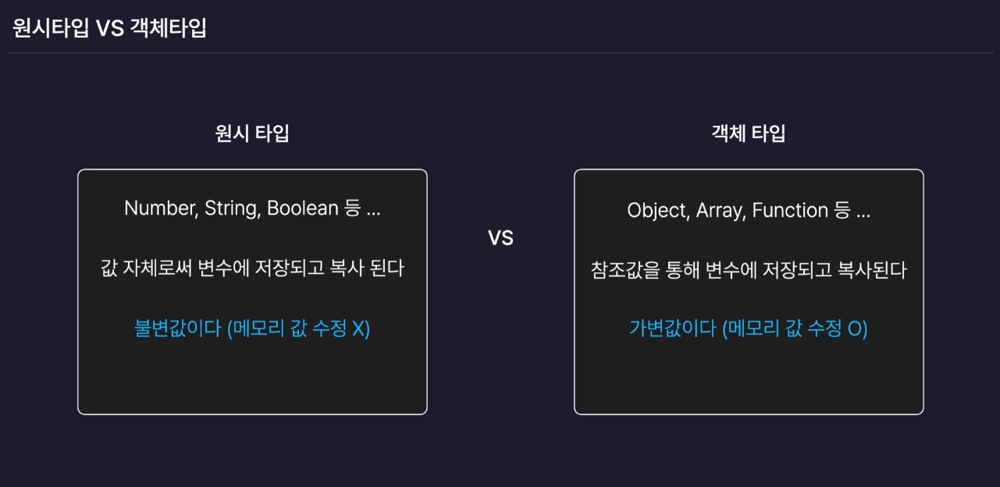
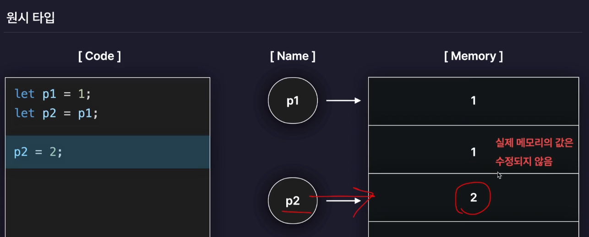
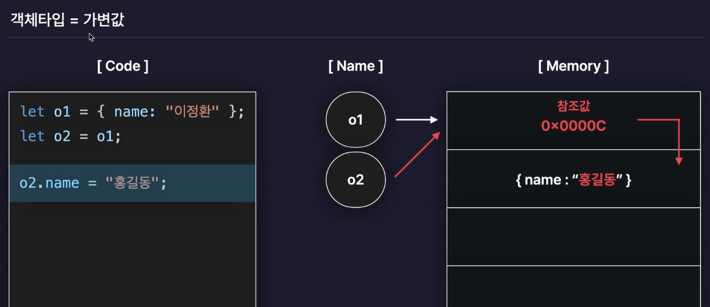
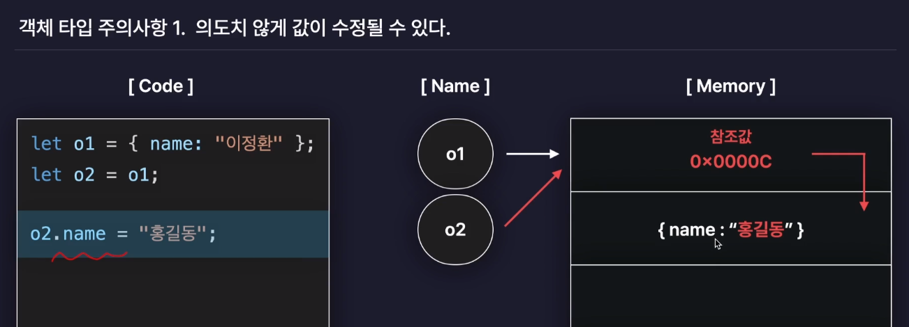
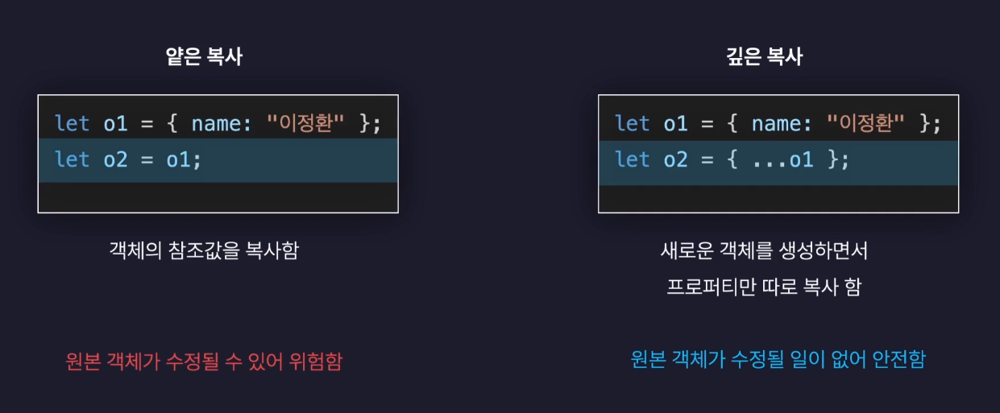
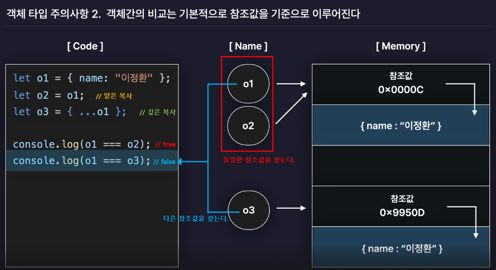
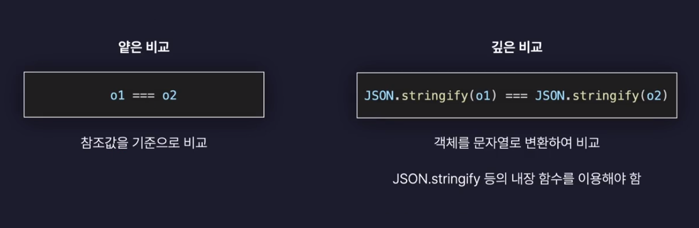
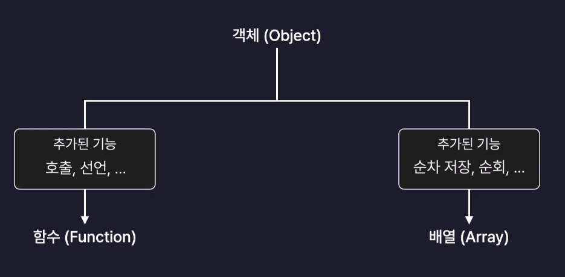

# ch01. Truthy 와 Falsy
## 2.1) Truthy와 Falsy

javascript는 true/false값이 아닌 값을 조건문에서 true/false 값으로 판별하는 경우가 있다.

Truthy 와 Falsy를 사용하면 조건문을 간결하게 작성할 수 있다.

### Falsy 한 값

false가 아니지만 조건식에서 false 값으로 판별되는 값.

- undefined
- null
- NaN
- “ ” (빈 문자열)
- 음수
- 0
- 0n (BigInt 타입, 자바스크립트 기본 숫자 타입(Number)의 범위를 넘어서는 큰 정수 값을 표현한다.)

### Truthy 한 값

true가 아니지만 조건식에서 true 값으로 판별되는 값.

Falsy 값 7개를 제외한 나머지 값은 다 Truthy 값이다.

- 원시타입의 값들
- 양수
- &#91;  &#93; (빈 배열)
- {  } (빈 객체)
- 함수

### 조건문에서 Falsy 값 활용하기

조건문에서 boolean Type을 판별할 때 각각의 boolean Type을 작성하는것 보다 Falsy 값으로 판별하면 더 간결한 조건문을 작성 할 수 있다.

```jsx
// a. boolean Type 별로 조건식을 작성
function getName1 (name) {
    if(person.names === undefined || person.names === null || person.names === '' ) {
        // undefined, null, 빈 문자열인 경우만 체크
        // 다른 falsy 조건이 추가되면 조건문이 길어진다.
        console.log('param Error');
        return;
    }
    console.log('안녕하세요 저는', name, '입니다.');
}

getName1(person.names);  // param Error

// b. Falsy 값으로 조건식 작성
function getName2 (name) {
    if(!person.names) {
        // undefined 이거나 null 인 경우만 체크
        // 다른 falsy 조건이 추가되면 조건문이 길어진다.
        console.log('param Error');
        return;
    }
    console.log('안녕하세요 저는', name, '입니다.');
}

getName2(person.names);  // param Error
```

<br /><br />

# ch02. 단락 평가 (Short-circuit Evaluation)
논리 연산자(AND, OR)를 사용한 조건식에서 첫번째 피연산자 값만으로 논리 연산식의 결과를 확정할 수 있는 경우 두번째 피연산자 값은 판별하지 않는 javascript의 기능

### AND 연산에서의 단락 평가

- AND 연산에서 첫번째 피연산자가 true인 경우 두번째 피연산자도 판별해야 하기 때문에 단락 평가가 수행되지 않는다.
- AND 연산에서 첫번째 피연산자가 false인 경우 결과가 false로 확정되기 때문에 단락 평가가 수행된다.

### OR 연산에서의 단락 평가

- OR 연산에서 첫번째 피연산자가 false인 경우 두번째 피연산자도 판별해야 하기 때문에 단락 평가가 수행되지 않는다.
- OR 연산에서 첫번째 피연산자가 true인 경우 결과가 true로 확정되기 때문에 단락 평가가 수행된다.

<br /><br />

# ch03. 구조 분해 할당
배열이나 객체를 분해하여 변수에 값을 할당하는 기능

### 배열의 구조 분해 할당

```jsx
let arr = ["a", "b", "c"];

// 배열의 구조 분해 할당
let [first, second, third] = arr;
console.log(first);  // a
console.log(second); // b
console.log(third);  // c
```

- 배열 구조 분해 할당시 존재하지 않는 값에 접근하는 경우

```jsx
let [first, second, third, fourth] = arr;
// 존재하지 않는 값에 접근시 undefined 반환 
console.log(fourth);   // undefined
```

- 배열 구조 분해 할당시 초기값 할당하기

```jsx
// 배열 구조 분해 할당시 존재하지 않는 변수에 초기 값 할당
let [first = "first Str", second, third, fourth = 'd'] = arr;
console.log(first);     // 이미 해당 인덱스에 값이 존재하면 존재하는 값을 리턴한다.
console.log(fourth);    // 인덱스에 값이 존재하지 않는 경우 할당된 초기값이 출력된다.
```

### 객체의 구조 분해 할당

```jsx
let person = {
    name: '여니',
    age: 99,
    hobby: '사진찍기'
};

// 객체의 구조 분해 할당
let {name, age, hobby} = person;

console.log(name);   // 여니
console.log(age);    // 99
console.log(hobby);  // 사진찍기
```

- 객체 구조 분해 할당시 존재하지 않는 값에 접근하는 경우

```
let {name, age, hobby, favorite} = person;
console.log(favorite);      // undefined
```

- 객체 구조 분해 할당시 존재하지 않는 변수 초기값 할당

```
let {name, age, hobby, favorite = "unKnown"} = person;
console.log(favorite);      // unKnown (구조 분해 할당시 설정한 초기값이 반환된다.)
```

- 객체 구조 분해 할당시 변수명 변경

```jsx
let {name: myName, age, hobby} = person;
console.log(myName);     // 여니

// 값 참조로 인해 빈 문자열 출력 
// 객체 구조 분해 할당 시 변수명 변경을 하면 값 복사를 하지 않고 기존 변수에 대한 참조를 만든다.
console.log(name);       // ''
```

### 객체 구조 분해 할당을 이용해서 함수의 매개변수를 받는 방법

```jsx
function getName1(person) {
    console.log(person);
}
getName1(person);   // {name: '여니', age: 99, hobby: '사진찍기'}

function getName2({name, age, hobby, extra}) {
    console.log(name);  // 여니
    console.log(age);   // 99
    console.log(hobby); // 사진찍기
    console.log(extra); // undefined
}
getName2(person);
```

<br /><br />

# ch04. Spread 연산자와 Rest 매개변수
## Spread 연산자

객체나 배열에 저장된 데이터를 개별 값으로 흩뿌려준다.

- 배열1을 배열2의 중간에 포함하거나, 객체1의 프로퍼티 중간에 객체2의 프로퍼티를 포함할 수 있다.
- 함수 호출시 배열에 저장된 값을 풀어서 전달 할 수 있다.
- 함수 호출시 객체에 저장된 값에 Spread 연산자를 사용하는 경우 오류가 발생한다.

`Uncaught TypeError: Spread syntax requires ...iterable[Symbol.iterator] to be a function`

## Rest 매개변수

Rest = 나머지 라는 뜻이다.

즉, 여러개의 개별 데이터를 Rest 매개변수로 받는 경우 배열에 담아서 받을 수 있다.

- 여러개의 개별 데이터를 Rest 매개변수로 받아올 때 Rest 매개변수를 사용하기 전, 원하는 만큼의 여러개 개별데이터를 배열에 담지 않고 받아올 수도 있다.

```jsx
// 여러개의 데이터를 매개변수로 받아올 때 
// 첫번째, 두번째 매개변수는 개별데이터로, 나머지 매개변수는 배열에 받기
function func3(firstFavorite, secondFavorite,  ...others) {
    console.log(firstFavorite);     // 딸기
    console.log(secondFavorite);    // 사과
    console.log(others);            // ['토마토', '체리']
}
func3('딸기', '사과', '토마토', '체리');
```

- Rest 매개변수를 사용 후 다른 변수명을 개별로 받아오려 하는 경우 오류가 발생한다.

`Rest parameter must be last formal parameter` 

⇒ Rest 매개변수 사용 전에만 데이터를 개별로 받아올 수 있다.

 

```jsx
// function func4(top1, ...others, top2) {     // Rest parameter must be last formal parameter
//      console.log(firstFavorite);
// }
// func4('강아지', '고양이', '햄스터', '금붕어');
```

<br /><br />

# ch05. 원시타입 vs 객체타입
원시타입과 객체타입을 구분하는 이유 = 값을 저장하는 방식이 다르다.


### 원시타입의 값 저장 방식

값 자체로써 변수에 저장되고 복사된다 = 불변값

변수에 새로운 값을 저장하려는 경우 메모리에 존재하는 기존 값을 수정하는것이 아니라 새로운 값을 새 메모리에 할당하여 변수에 새로운 참조값을 저장한다.


### 객체타입의 값 저장 방식

참조값을 통해 변수에 저장되고 복사된다 = 가변값

기존 객체에 저장된 값을 수정하는 경우 해당 참조값에 존재하는 객체의 값을 수정한다.


## 객체 타입 주의사항

### 1.객체타입의 값 변경시 의도치 않게 값이 변경될 수 있다.

기존에 존재하는 객체값을 새로운 변수에 할당하려는 경우 기존의 변수와 새 변수 모두 참조값 주소를 동일하게 갖는다.

참조값에 저장된 객체 프로퍼티를 수정하는 경우 동일한 참조값을 공유하는 변수들은 수정된 객체값을 동일하게 공유하게 되는 문제가 생길 수 있다.

⇒ 이처럼 **하나의 변화가 다른 변수에 영향을 주는거나 받는것**을 Side effect라고 한다.



### 얕은복사 / 깊은복사


**얕은 복사**
→ 객체의 참조값을 복사한다. 원본 객체가 수정되는 경우 수정된 객체를 동일하게 공유한다.
**원본 객체가 수정될 수 있는 위험성이 존재한다.**

**깊은 복사**
→ 기존에 존재하는 프로퍼티만 복사하여 새로운 객체를 생성한다. 원본 객체와는 다른 새로운 참조값을 갖는다.


### 2. 객체간의 비교는 참조값을 기준으로 이루어진다.


### 얕은비교 / 깊은비교


**얕은 비교**
→ `===` 연산자를 사용하여 객체의 참조값을 비교한다.

**깊은 비교**
→ 자바스크립트 내장 함수 `JSON.stringify()`를 사용하여 객체를 문자열로 변환하여 객체 내부의 프로퍼티가 동일한지 비교할 수 있다.

### 3. 배열과 함수도 사실 객체이다.
배열과 함수도 사실 객체이며 추가적인 프로퍼티나 메서드를 가질 수 있다.


<br /><br />

# ch06. 반복문으로 배열과 객체 순회하기
## 순회(Iteration)이란?

배열, 객체에 저장된 여러개의 값에 순차적으로 접근하는것을 말한다.

## 반복문을 이용한 배열, 객체 순회

### 1. 배열 순회

1-1. 배열 인덱스 출력하기

`for문` 내부에서 `i`를 사용하여 추가적인 작업을 할 수 있다.

1-2. `for of` 반복문
배열을 순회하며 배열의 값을 순차적으로 가져온다.

### 2. 객체 순회

2-1. `Object.keys` 사용

객체에서 key 값들만 뽑아서 새로운 배열로 반환한다.

2-2. `Object.values` 사용

객체에서 value 값들만 뽑아서 새로운 배열로 반환한다.

2-3. `for in` 사용

객체를 순회하며 객체의 key값을 순차적으로 가져온다.
객체의 프로퍼티 존재여부를 확인하는 `in 연산자`를 떠올려 `for of` 와 헷갈리지 않도록 주의한다.

<br /><br />

# ch07. 배열 메서드 1. 요소 조작
### 1. push 메서드

배열 마지막 요소의 값을 추가한다.

push 메서드 실행 후 배열의 총 길이를 반환한다.

원본 배열값이 변한다.<br />

### 2. pop 메서드

배열 마지막 요소의 값을 제거한다.

pop 메서드 실행 후 추출한 값을 반환환다.

원본 배열값이 변한다.<br />

### 3. shift

배열의 첫번재 요소의 자리의 값을 제거한다.

값 제거 후 배열을 반환한다.

원본 배열값이 변한다.<br />

### 4. unshift

배열의 첫번재 요소의 자리에 값을 추가한다.

값 추가 후 배열의 길이를 반환한다.

원본 배열값이 변한다.<br />

### `push&pop` 메서드와 `shift&unshift` 메서드 비교

`shift`와 `unshift`는 **전체 요소의 인덱스가 이동해야하므로 비효율적으로 동작**한다. 

배열의 요소값을 변화할 때는 push와 pop을 이용하는것이 좋다.<br />

### 5. slice

시작인덱스 ~ 종료인덱스 까지의 배열을 자른다.

메서드 수행 후 결과 배열을 반환한다.<br />

**원본 배열값은 변하지 않는다.**

`slice(시작할 인덱스, 종료할 인덱스 + 1)`

slice메서드의 종료할 인덱스 생략시 시작 인덱스부터 배열의 마지막 인덱스까지 자른다.

인덱스에 음수를 사용하면 배열 요소의 인덱스를 거꾸로 인식한다.<br />

### 6. concat

두개의 배열을 합쳐서 반환한다.

`첫번째 배열.concat(두번째 배열)` = `첫번째 배열` + `두번째 배열`

**원본 배열값은 변하지 않는다.**

<br /><br />

# ch08. 배열 메서드 2. 순회와 탐색
### 1. forEach

배열의 모든 요소를 순회하면서, 각각의 요소 순회시마다 특정 동작(콜백 함수)을 수행하는 메서드

forEach 내부에 사용하는 함수에는 아래의 매개변수가 온다.

- value : index 번째 배열요소
- index : 배열을 순회하는 index
- array : 메서드를 수행하는 배열

### 2. includes

배열에 특정 요소가 있는지 반환하고, 존재하면 true / 존재하지 않으면 false 반환하는 메서드

### 3. indexOf()

배열에 특정요소가 존재하는 경우 해당 요소의 index를 반환하는 메서드

존재하는 인덱스가 여러개인 경우 0번 인덱스에서 제일 가까운 인덱스를 반환한다.

존재하지 않는 요소인 경우 -1을 반환한다.

### 4. findIndex

배열의 모든 요소를 순회하며, 콜백함수를 실행하고 함수의 결과값을 true로 만들어 주는 요소의 index를 반환한다.

함수의 결과값을 true로 만들어주는 요소가 없는 경우 -1을 반환한다.

### indexOf 와 findIndex의 차이

indexOf는 동등연산자(===)를 이용한 얕은 비교만 수행한다. ↔ 객체 프로퍼티 비교는 불가

findIndex를 사용하여 객체의 프로퍼티 값을 비교하는 깊은 비교를 할 수 있다.

### 5. find

모든 요소를 순회하며 콜백 함수를 만족하는 요소(element)를 그대로 반환한다.

<br /><br />

# ch09. 배열 메서드 3. 배열 변형
### 1. filter

기존 배열의 모든 요소를 순회하며, filter 메서드에 사용하는 콜백함수의 조건에 해당하는 요소만 필터링하여 새로운 배열로 반환

filter 메서드의 콜백함수는 3개의 매개변수가 존재한다.

- value : index 번째 배열요소
- index : 배열을 순회하는 index
- array : 메서드를 수행하는 배열

### 2. map

기존 배열의 모든 요소를 순회하며, map 메서드의 콜백함수를 실행하고 그 결과값들을 모아서 새로운 배열로 반환

기존 배열을 변형하여 새로운 배열값을 얻을 수 있다.

map 메서드의 콜백함수는 3개의 매개변수가 존재한다.

- value : index 번째 배열요소
- index : 배열을 순회하는 index
- array : 메서드를 수행하는 배열

**[ filter와 map메서드 동시에 사용하기 ]**

```jsx
let personArr = [
    {name: "Nancy", age: 25, gender: "female",},
    {name: "Bob", age: 30, gender: "male",},
    {name: "Catherine", age: 35, gender: "female",},
];

// map 메서드를 사용하여 personArr중  gender: "female"인 name 값만 모아서 새 배열로 반환하기
let femaleArr = personArr.filter((item) => item.gender === 'female').map((item) => item.name);
console.log(femaleArr);     // ['Nancy', 'Catherine'] 
```

### 3. sort

배열을 사전순으로 정렬해준다.

메서드 호출시 기존 배열의 정렬을 변경한다. →  **원본 배열을 변경한다.**

배열의 요소를 정렬하는 기준이 사전식 이기 때문에 숫자의 대소비교 정렬은 sort 메서드의 콜백함수를 이용해야 한다.

**[ sort 메서드를 사용하여 숫자 오름차순/내림차순 정렬하기 ]**

- sort 메서드의 매개변수 a, b는 i, i+1 번째 인덱스의 요소를 가져온다.
- a, b 판별 조건식 내부에서 양수, 음수, 0 리턴시마다 숫자 배치가 달라진다.

```jsx
// 오름차순 정렬하기
arrNum2.sort((a, b) => {
    // sort 메서드의 매개변수 a, b는 i, i+1 번째 인덱스의 요소를 가져온다.
    if(a > b) {
        // a > b 인 경우 
        return 1;   // -> 양수를 리턴하면 b, a 순서로 배치한다. = b 가 a 앞에 와라
    } else if (b > a) {
        // b > a 인 경우 
        return -1;  // -> 음수를 리턴하면 a, b 순서로 배치한다. = a 가 b 앞에 와라
    } else {
        // a = b 인 경우
        return 0;   // -> 0을 리턴하면 자리를 바꾸지 않고 그대로 유지한다. = 자리를 바꾸지 마라
    }
    }
);
// console.log(arrNum2);   //  [4, 7, 12, 29, 30, 34] -> 오름차순으로 숫자를 정렬할 수 있다.

// 내림차순으로 정렬하기
arrNum2.sort((a, b) => {
    if(a > b) {
        return -1;
    } else if (b > a) {
        return 1;
    } else {
        return 0;
    }
})
// console.log(arrNum2);   //  [34, 30, 29, 12, 7, 4]
```

### 4. toSorted  (가장 최근에 추가된 최신 함수)

sort 와 동일한 기능을 하지만 원본 배열을 변경하지 않고, 메서드 수행시에 변경된 배열을 새롭게 반환한다. 

```jsx
let arr3 = ["tiger", "lion", "rabbit", "cat", "puppy"];

let newArr = arr3.toSorted();
console.log(newArr);   //  ['cat', 'lion', 'puppy', 'rabbit', 'tiger']
console.log(arr3);     // ['tiger', 'lion', 'rabbit', 'cat', 'puppy']
```

### 5. join

배열의 모든 요소를 문자열로 합쳐서 반환하는 메서드

join 메서드 실행시 매개변수로 구분자를 지정할 수 있다. (매개변수 미지정시 기본 구분자는 ',')

```jsx
let newStrArr2 = strArr.join('*'); 
console.log(newStrArr2);   // hello*im*yeoonnii
let newStrArr3 = strArr.join('');
console.log(newStrArr3);  // helloimyeoonnii
```

<br /><br />

# ch10. Date 객체와 날짜
## 1. Date 객체 생성하기

- `new` 생성자 사용하여 객체 생성
    - `new Date()` 사용시 현재 시간을 가져온다.
    - `new Date("2024-01-23")` 또는 `new Date("2024-01-23 01:01:23")` 와 같이 날짜나 시간을 직접 지정하여 객체를 생성하는것도 가능하다.<br />

## 2. 타임스탬프

- 특정 시간이 `1970.01.01 00시 00분 00초(=UTC)` 로부터 몇 ms가 지났는지를 의미하는 숫자값
- 복잡한 시간 정보를 숫자로 나타낼 수 있기 때문에 연산시 자주 사용된다.
- `Date`객체에 `.getTime()` 메서드를 사용하면 타임스탬프 값(ex. 1705939283000) 을 반환한다.
- `new Date(타임스탬프 값)` → 타임스탬프 값을 매개변수로 넣어 Date 객체 생성시 타임스탬프값을 Date 객체로 변환 후 반환해준다.<br />

## 3. 시간요소(날짜,시간) 추출

- `get~` 으로 시작하는 메서드를 사용하여 Date 객체의 시간요소를 추출 할 수 있다.
- `getMonth()` 메서드로 month 값 추출시 반환하는 month 값은 index 값과 같게 취급하기 때문에 1을 추가해주어야 한다.<br />

## 4. 시간요소(날짜,시간) 수정

- `set~` 으로 시작하는 메서드를 사용하여 Date 객체의 시간요소를 수정할 수 있다.
- `setMonth()` 메서드로 month 값 수정시 매개변수의 month 값은 index 값과 같게 취급하기 때문에 1을 빼주어야 한다.<br />

## 5. Date 객체를 여러 포맷으로 출력하기

- `toDateString()` , `toTimeString()` , `toLocaleDateString()` , `toLocaleTimeString()` 을 사용하여 다양한 포맷으로 시간요소 출력이 가능하다.<br />