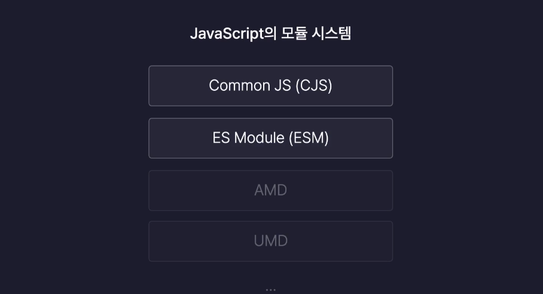

## 📌section03 목차

### Node.js 기초
[Node.js](#-node.js)<br />
[NPM(Node Package Manager)](#-npm(node-package-manager))<br />
[모듈(Module)](#-모듈(module))<br />
[모듈 시스템(Module System)](#-모듈-시스템(module-system))<br />
[패키지(Package)](#-패키지(package))<br />
[라이브러리(Library)](#-라이브러리(library))<br />

<hr />

# Node.js 기초

## Node.js

웹 브라우저가 아닌 환경에서도 JavaScript를 실행시켜주는 **JavaScript 실행환경(Run Time)** 이다.

**실행환경(Run Time) = 구동기**

## NPM(Node Package Manager)

Node.js의 패키지 단위를 관리하는 도구

패키지를 관리하거나 외부 라이브러리를 다운받는 등의 기능을 제공한다.

Node.js 설치시 npm이 함께 설치된다.

## 모듈(Module)

기능별로 나누어진 각각의 파일

## 모듈 시스템(Module System)

모듈을 생성하고, 불러오고 사용하는 등의 모듈을 다루는 다양한 기능을 제공하는 시스템

## 자바스크립트의 모듈 시스템



**Common JS 모듈 시스템과 ES 모듈 시스템은 동시에 사용할 수 없다.**

### 1. CJS (Common JS 모듈 시스템) 사용하기

1-1. module 객체의 export 메서드로 내보낸다.

내보낼 key, value 값이 동일한 경우 변수값만 적어도 된다.

```jsx
// math.js
function add(a, b) {
  return a + b;
}

function sub(a, b) {
  return a - b;
}

module.exports = {
  add: add,
  sub: sub,
};
```

1-2. require를 이용하여 모듈의 경로를 인수로 전달하여 반환받아 사용이 가능하다.

```jsx
// index.js
const { add, sub } = require("./math.js");
```

### 2. ESM (ES 모듈 시스템) 사용하기

2-1. package.json 에 `“type”:”module”` 옵션을 추가해 줘야 한다.

2-2. `export` 키워드 뒤에 객체를 리터럴로 생성해서 내보내고 싶은 값을 담아주면 된다.

2-3. export 키워드를 별도로 사용해도 되지만, 함수선언문 앞에 export 키워드를 사용해도 된다.

```jsx
// math.js
// 2-2.
export {
  // add : add, sub: sub // --> 내보낼 key 값과 value 값이 동일한 경우 생략하여 사용가능하다.
  add,
  sub,
};

// 2-3.
export function add(a, b) {
  return a + b;
}

export function sub(a, b) {
  return a - b;
}
```

2-4. `import` 키워드 + 가져올 값 명시 + `from` + 모듈의 경로 + 확장자 형태로 사용한다.

```jsx
// 2-4. import 키워드 + 가져올 값 명시 + from + 모듈의 경로 + 확장자
// import { add, sub } from './math.js'
```

2-5. 하나의 모듈을 대표하는 default 값을 내보낼 수도 있다.

export default 키워드가 붙은 함수는 math 모듈을 대표하는 기본값이 된다.

대표 기본값으로 내보내진(export default) 함수는 다른 모듈에서 중괄호 없이 import 하여 사용가능하다.

```jsx
// math.js
export default function multiply(a, b) {
  return a * b;
}

// index.js
import multiply from "./math.js";
```

2-6. 동일한 경로로 부터 값을 불러오는 여러개의 import 문은 합쳐서 사용하는것도 가능하다.

```jsx
// index.js
import multiply, { add, sub } from "./math.js";
```

## 패키지(Package)

프로젝트 : 프로그래밍에서 특정 목적을 갖는 프로그램의 단위 (쇼핑몰 프로젝트, 웹 프로젝트 등)

패키지 : Node.js 에서 사용하는 프로그램의 단위 (쇼핑몰 패키지, 웹 패키지 등)

## 패키지 생성하기

```jsx
// 터미널 실행 후 명령어 입력
npm init
```

## 패키지 스크립트 이용하기

패키지 스크립트 란?

package.json 내부에 존재하는 `“scripts”` 항목안에 있으며 특정 작업을 수행하는 일종의 매크로 역할을 한다.

```jsx
// package.json
...
"scripts": {
    "test": "echo \"Error: no test specified\" && exit 1",
    "start": "node index.js"
  },
..
```

`"start": "node index.js"` 추가 후 터미널에 `npm run start` 명령어를 입력하면 `"start"` 에 입력된 `node index.js` 명령이 실행된다.

## 라이브러리(Library)

프로그램을 개발할 때 필요한 다양한 기능들을 미리 만들어 모듈화 해 놓은 것

https://www.npmjs.com/ ⇒ node.js 라이브러리 설치시 참고

## 라이브러리 설치

`npm i '설치할 패키지 이름'` 을 통해 라이브러리를 설치 할 수 있다.

### 라이브러리 설치 후

- package.json 에 `"dependencies"` 항목이 추가된다.

```json
 "dependencies": {
    "randomcolor": "^0.6.2"  // '패키지 명 : 버전' 이 명시된다.
  }
```

- node_modules 폴더가 생성 되고 폴더 하위에 패키지명 폴더가 생성된다.
  패키지명 폴더 하위에는 해당 라이브러리 파일이 저장되어 있다.
  - `node_modules` : 패키지에 실제 설치된 라이브러리의 저장소
- package-lock.json 파일이 생성된다.
  - 패키지가 사용하고 있는 라이브러리의 버전이나 정보를 정확하고 엄밀하게 저장한다.

### package.json 과 package-lock.json 의 차이

- package.json : 대략적인 라이브러리의 정보를 저장
  - Version Range (버전 범위) : package.json에 명시된 라이브러리의 버전 정보 앞에 표시된 `^` 기호
  - 정확한 버전이 아니라 대략적인 버전을 표기한 것을 의미한다.
- package-lock.json : package.json 보다 정확하고 상세한 라이브러리의 정보를 저장
