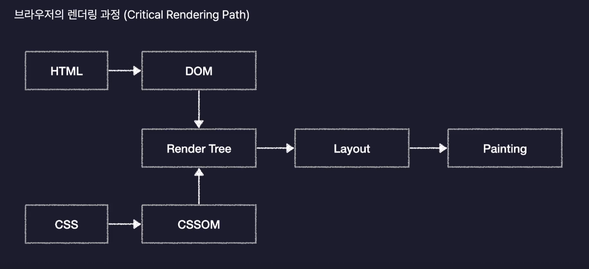
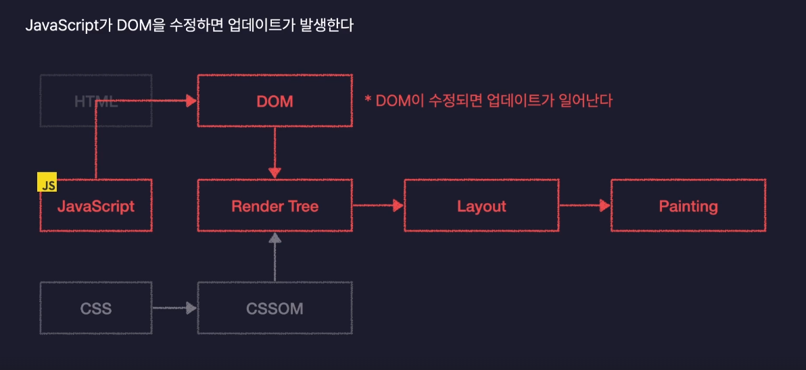
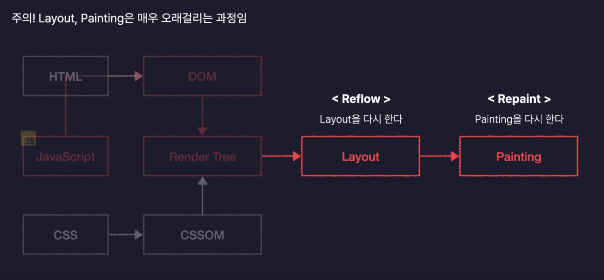
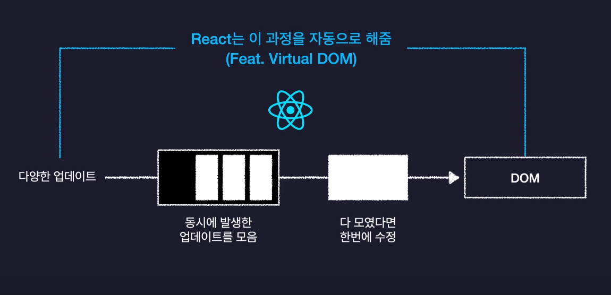
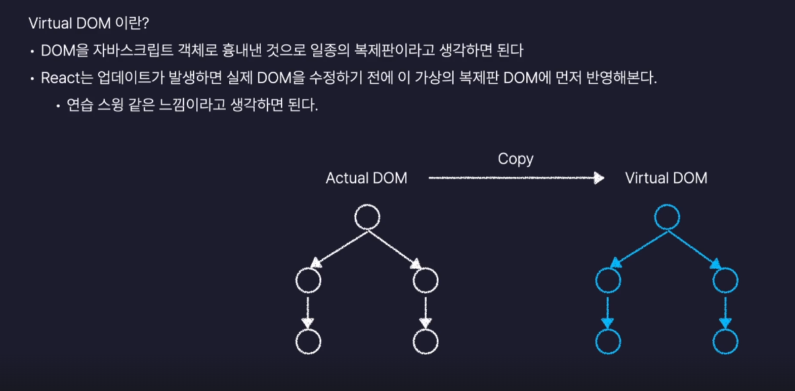

## 📌section04 목차

### React.js 개론
[React.js](#reactjs) 
[React의 기술적인 특징](#react의-기술적인-특징) 
[React의 화면 업데이트 과정](#react의-화면-업데이트-과정) 

# React.js 개론

## React.js

Meta(Facebook)이 개발한 오픈소스, 프론트엔드 JavaScript 라이브러리

대규모 웹 서비스의 UI를 더 편하게 개발하기 위해 만들어진 기술이다.

 

## React의 기술적인 특징

### 1. 컴포넌트를 기반으로 UI를 표현한다.

컴포넌트(Component) : 우리말로 “구성요소” 라는 뜻이며 화면을 구성하는 요소, UI를 구성하는 요소를 말함

공통적으로 사용되는 화면을 컴포넌트 단위로 모듈화 하여 사용한다.

→ 중복 코드를 제거하여 유지보수가 용이하다

→ 여러컴포넌트에서 공통으로 사용되는 요소들을 재사용 할 수 있다.

### 2. 화면 업데이트 구현이 쉽다.

업데이트 : 사용자에 행동(클릭, 드래그)에 따라 웹페이지가 바뀌며 사용자와 상호작용 하는 모든 기능

React.js는 ‘선언형 프로그래밍’이기 때문에 화면 업데이트를 구현하기 쉽다.

업데이트를 위한 복잡한 동작을 직접 정의할 필요 없이 특정 변수의 값을 바꾸는것 만으로도 화면을 업데이트 시킬 수 있다.

- 선언형 프로그래밍
    - 과정은 생략하고 목적만 간결히 명시하는 방법
    - 목적만 깔끔하게 명시하기 때문에 코드가 간결하다.
    
    ex. 식당에서 주문시 ‘토마토 파스타 하나 주세요’ 라고 주문하는것과 유사하다. 
    
    → 어떻게 만드는지(과정)은 모른다. 메뉴(목적)만 명시한다.
    
- 명령형 프로그래밍
    - 목적을 이루기 위한 모든 일련의 과정을 설명하는 방식
    - 모든과정을 하나하나 다 설명하기 때문에 코드가 길고 복잡해질 수 있다.
    
    ex. 진상 손님처럼 주문하는 방식이다. ‘주방에서 면 100g을 꺼내고 뜨거운 물에 9분간 삶으세요. 그런다음….. ‘ → 메뉴(목적)을 이루기 위한 모든 과정을 설명한다.
    

### 3. 화면 업데이트가 빠르게 처리된다.

- DOM (Document Object Model)
    
    HTML 코드를 브라우저가 이해하기 쉽도록 변환한 객체
    
    요소(element)들의 위치, 배치, 모양에 관한 모든 정보
    
    = HTML 문서를 객체로 변환한것
    
- CSSOM (CSS Object Model)
    
    CSS 코드를 브라우저가 이해하기 쉽도록 변환한 객체
    
    요소(element)들의 스타일과 관련된 모든 정보
    
- Render Tree
    
    웹페이지의 청사진, DOM 과 CSSOM 이 포함되어 있는 설계도이다.
    
- Layout
    
    요소(element)의 배치를 잡는 작업
    
- Painting
    
    실제로 화면에 그려내는 과정

 

## React의 화면 업데이트 과정

### 화면 업데이트가 일어나는 과정

JavaSctipt가 DOM을 수정하면 브라우저의 렌더링 과정(Critical Rendering Path)가 다시 수행된다.

브라우저의 렌더링 과정(Critical Rendering Path) 중 Layout과 Painting은 오래 걸리는 과정이다.

- Reflow
    
    Layout을 다시 한다.
    
- Repaint
    
    Painting을 다시 한다.
    
- 잦은 DOM 수정 빈도로 인해 Reflow, Repaint 가 과도하게 수행되면 브라우저 성능에 영향을 미칠 수 있다.
    
    ⇒ **DOM 수정을 최소화 해야 브라우저 성능이 최적화 된다.**

 

### React의 화면 업데이트 과정

React는 DOM 수정을 최소화 하는 과정을 자동으로 수행한다.

   
 

### React의 Vitrual DOM

Vitrual DOM
- 실제 브라우저가 렌더링 하는 DOM을 JavaScript 객체로 복제한 것
- React에서는 Vitrual DOM을 사용하여 DOM을 수정해야 하는 경우 실제 DOM을 즉시 수정하는 것이 아니라, Vitrual DOM을 먼저 수정한다.

 

React는 수정된 여러 내역들을 모아 Vitrual DOM에 반영하고 실제 DOM은 1번만 수정한다.

수정 할 내역들을 Vitrual DOM에 모아두었다가 업데이트가 수행되기 때문에,
실제 DOM 수정 횟수는 최소한으로 진행되어 브라우저 성능의 최적화가 보장이 된다.
