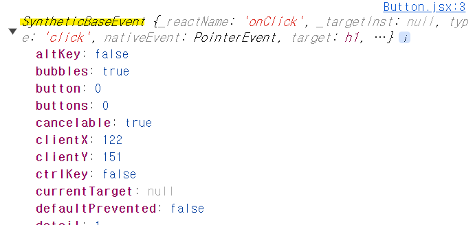
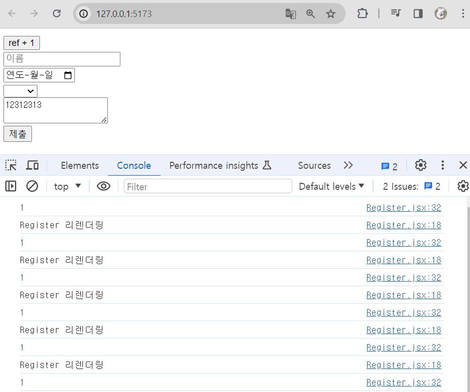
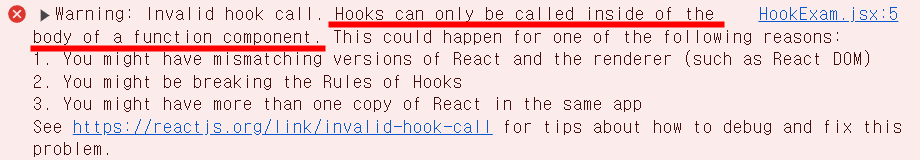

# React.js 입문

## ch01. React App 생성하기

### Vite로 React 프로젝트 생성하기

1. React 프로젝트 생성

```jsx
npm create vite@latest
```

2. package.json 라이브러리 설치

```jsx
npm install 혹은 npm i
```

3. 기본 생성되는 .eslintrc.cjs 파일에 추가 설정을 해준다.

```jsx
...
  rules: {
	  ...
    "no-unused-vars": "off", // 코드에서 실제로 사용하지 않는 변수가 있을 때 오류를 발생시키는 옵션
    "react/prop-types": "off", // React를 안정적으로 사용하기 위한 옵션
...
```

4. .gitignore 파일에 git에 업로드할 파일을 명시한다.

```jsx
# Ignore the .gitignore file itself
.gitignore
```

### VSCode Extension - ESlint 설치

ESLint는 자바스크립트 코드에서 발견되는 문제시되는 패턴들을 식별하기 위한 정적 코드 분석 도구이다.
[참고 링크 : ESlint 공식 홈페이지](https://eslint.org/)

<br><br>

## ch02. React Component

### React 컴포넌트란?

- JavaScript 함수에서 return 문에 html 태그들을 반환하는 함수를 말한다.

```jsx
// Header 컴포넌트
const Header = () => {
  return (
    <header>
      <h1>header</h1>
    </header>
  );
};
```

### 컴포넌트 생성방법

- 컴포넌트 이름은 대부분 해당 함수의 이름을 따서 부르며, 대문자로 시작해야 한다.
- 컴포넌트는 함수형 컴포넌트와 클래스형 컴포넌트 두가지 형태로 작성할 수 있다.
    
    → 클래스형 컴포넌트 사용시 작성해야하는 코드의 양이 많아지기 때문에 함수형 컴포넌트를 많이 사용한다.
    
- 함수형 컴포넌트는 function, 화살표 함수로 생성할 수 있다.

```jsx
// function을 사용한 컴포넌트
function Header() {
  return (
    <header>
      <h1>header</h1>
    </header>
  );
}

// 화살표 함수를 사용한 컴포넌트 
const Header = () => {
  return (
    <header>
      <h1>header</h1>
    </header>
  );
};
```

### 부모/자식 컴포넌트

- ROOT (App) 컴포넌트 : 최상위 조상 컴포넌트
- 자식 컴포넌트 : 본인의 컴포넌트가 다른 컴포넌트 return문에 포함된 컴포넌트
- 부모 컴포넌트 : 본인 컴포넌트 return문 내부에 다른 컴포넌트를 포함함


### 컴포넌트 모듈화

- Es 모듈 시스템에 의해 특정 컴포넌트를 `export` , `import` 하여 사용할 수 있다.
- vite로 생성한 React 프로젝트에서 import 시 확장자를 생략해도 인식이 가능하다. (vite 내부에 자동 설정되어 있음)

<br><br>

## ch03. JSX로 UI 표현하기

### JSX (JavaScript Extensions)

- 확장된 자바스크립트의 문법이며 React.js에서 JSX 문법을 사용한다.
- JavaScript와 Html을 혼용하여 사용할 수 있다.

### JSX 주의사항

1. JSX return 문의 중괄호 내부에는 자바스크립트 표현식만 넣을 수 있다.
    - 자바스크립트 표현식 : 한줄의 코드가 특정한 값으로 평가 될 수 있는 식
    - `if`, `for` 과 같은 조건문은 자바스크립트 표현식이 아니기 때문에 return 문에서 사용이 불가하다.
2. 숫자, 문자열, 배열 값만 렌더링 된다.
    - `boolean`, `undifined`, `null` 값은 화면에 렌더링이 불가하다.
    - `Objcet`(객체) 값은 렌더링이 불가하다. 점 표기법 `obj.a` 과 같이 객체의 프로퍼티를 꺼낸값이 문자나 숫자인 경우만 렌더링이 가능하다.
3. 모든 태그는 닫혀있어야 한다.
    - 태그를 사용시 `/`를 사용한 닫는 태그가 존재해야 한다.
4. 최상위 태그는 반드시 하나여야만 한다.
    - 최상위 태그에 사용할 만한 태그가 없는 경우 Fragment (= 빈 태그, `<> </>`) 를 사용해준다.
    
    ```jsx
    // 닫는 태그가 하나인 경우
    return (
    	<>
    		<h1>Hello</h1>
    	</>
    )
    
    // ERROR : 닫는 태그가 하나이상인 경우
    return (
    	<div></div>
    	<div>
    		<h1>Hello</h1>
    	</div>
    )
    ```
    

### React Fragment (= 빈 태그, `<> </>`)

- 컴포넌트가 여러 엘리먼트를 return 할때 JSX 규칙상 하나의 태그로 묶어서 return 해줘야 한다. 이때 Fragment 를 사용하면 DOM에 별도의 노드를 추가하지 않고 여러자식을 그룹화 할 수 있다.
- Fragment는 불필요한 DOM의 생성을 막기 때문에 메모리를 적게 사용한다.

[참고 링크 : **React docs**](https://ko.legacy.reactjs.org/docs/fragments.html)

### JSX에서 삼항연산자를 이용한 조건부 렌더링

```jsx
const Main = () => {
  const user = {
    namd: "user1",
    isLogin: true,
  };

// 방법 1
 if (user.isLogin) {
    return <div>로그아웃</div>;
  } else {
    return <div>로그인</div>;
  }
  
// 방법 2
  return <>{user.isLogin ? "로그아웃" : "로그인"}</>;

};

export default Main;
```

### JSX에서 DOM 요소에 style 적용하기

1. 요소에 style 직접 적용하기
    - html element에 style 적용시 케밥 케이스(kebab-case) 표기법 사용 `background-color`
        
        → JSX element에 style 적용시에는 카멜케이스(camelCase) 표기법 사용 `background-color`
        

```jsx
<div style={{ backgroundColor: "pink", border: "5px solid green" }}>
	로그아웃
</div>
```

1. 별도의 css 파일을 import 하여 사용하기
    - import +  css 파일 경로
    - element에 className 속성을 사용하여 css에 정의된 class를 사용
        - JSX는 html과 JavsScript를 같이 사용하기 때문에 , JavaScript의 예약어인 `class` 를 사용할 수 없다. 대신 `className` 을 사용하여 css에 정의된 class를 사용한다.

```jsx
// 컴포넌트
import "./Main.css";
...
<div className="logout">로그아웃</div>

// css 파일
.logout {
    background-color: pink;
    border: 5px solid green;
}
```
<br><br>

## ch04. props로 데이터 전달하기
### props 란?

- props는 property를 뜻하며 다른 컴포넌트에 값을 전달할 때 props를 사용한다.
- 컴포넌트에 전달되는 props는 파라미터를 통하여 값을 가져올 수 있다.
- props를 통해 주어진 값에 따라 각각 컴포넌트 별 렌더링이 가능하다.
- props는 자식컴포넌트 → 부모컴포넌트로만 전달할 수 있다.

### props 사용 방법

부모 컴포넌트에서 전달한 값을 자식컴포넌트에서 `props` 를 사용하여 값을 가져올 수 있다.

```jsx
// 부모 컴포넌트
const Main = () => {
  return (
    <>
    <Button text={"메일"} color={"red"}/><br />
    <Button text={"카페"} color={"blue"}/><br />
    <Button text={"블로그"} color={"green"}/><br />
    </>
  )
};

export default Main;

// 자식 컴포넌트
// props 사용법 1. props를 이용하여 전달한 값을 가져올 수 있다.
const Button = (props) => {
    return <button style={{props.color}}>{props.text}</button>
}

// props 사용법 2. 구조분해 할당을 이용하여 props를 가져올 수 있다.
const Button = ({text, color}) => {
    return <button style={{color}}>{text}</button>
}

export default Button;
```

### ~~defaultProps 설정하기~~ → Deprecate !

컴포넌트에 props를 지정하지 않았을 때 기본적으로 사용할 값이 설정되지 않은 상태에서 작업을 하면 문제가 발생할 수 있다.

이를 방지하기 위해 부모 컴포넌트에서 특정 props 값이 주어지지 않았을 때 자식 컴포넌트에서 기본적으로 사용할 props값을 ~~`defaultProps`~~라고 한다.

```jsx
const Button = ({text, color}) => {
    return <button style={{color}}>{text} - {color.toUpperCase()}</button>
}

// defaultProps 를 사용하여 기본값을 설정
Button.defaultProps = {
    color: "black",
}

export default Button;
```

### ~~defaultProps~~대신 default parameters 사용하기

React에서는 2019년부터 `defaultProps` 사용을 **Deprecate** 하였으며 React 18.2 버전에서 `defaultProps`를 사용하는 경우 Console 탭에 Warning 문구가 발생한다.

Warning 문구에서는 JavaScript의 **default parameters**를 사용하도록 권장한다.


`defaultProps` 대신 JavaScript의 **default parameters**를 사용하여 아래와 같이 코드를 작성할 수 있다.<br />
[[🌍참고링크] JavaScript의 default parameters](https://developer.mozilla.org/en-US/docs/Web/JavaScript/Reference/Functions/Default_parameters#description)

```
const Button = ({text, color = "black"}) => {
    return <button style={{color}}>{text} - {color.toUpperCase()}</button>
}

export default Button;
```

### 여러개의 props를 전달해야 하는 경우

여러개의 props를 나열하는 경우 props가 많아질수록 코드가 복잡해 보일 수 있다.

이런경우 전달하는 컴포넌트에서 별도의 `props` 객체를 생성하고, 자식 컴포넌트에 `props` 전달시 스프레드 연산자를 이용하여 전달할 수 있다.

```jsx
// 부모 컴포넌트
import Button from "./Button";
import "./Main.css";
const Main = () => {
  // * 전달할 props 객체 *
  const buttonProps = {
    text: "메일",
    color: "pink",
    a: 1,
    b: 2,
    c: 3
  }

  return (
    <>
    // * props 객체 전달시 spread 연산자를 사용하여 전달 *
    <Button {...buttonProps}/><br />
    <Button text={"카페"} color={"blue"}/><br />
    <Button text={"블로그"} color={"green"}/><br />
    </>
  )
};

export default Main;

// 자식 컴포넌트
// default parameters를 사용하여 기본값을 세팅
const Button = ({text, color = "black", a = 0, b = 0, c = 0}) => {
    return <button style={{color}}>{text} - {color.toUpperCase()} - {[a,b,c]}</button>
}

export default Button;

```

### props에 전달할 수 있는 값들

JavaScript의 값들뿐만 아니라 HTML의 element, React 컴포넌트도 전달이 가능하다.

### props에 element 전달하기

```jsx
// 부모 컴포넌트
...
// 컴포넌트 태그 사이에 전달할 element 태그를 작성
<Button text={"자식요소"}>
   <div>전달할 자식 Element</div>
</Button>
...

// 자식 컴포넌트
// children을 사용하여 부모에서 전달한 element 값을 반환받는다.
const Button = ({text, color = "black", a = 0, b = 0, c = 0, children = null}) => {
    return (
	    <button style={{color}}>
	        {text} - {color.toUpperCase()} - {[a,b,c]} 
	        {children}
	    </button>
    )
}
...
```

### props에 컴포넌트 전달하기

```jsx
// 부모 컴포넌트
...
// 컴포넌트 태그 사이에 전달할 컴포넌트 태그를 작성
<Button text={"자식요소"}>
   <Header />
</Button>
...

// 자식 컴포넌트
// children을 사용하여 부모에서 전달한 컴포넌트를 반환받는다.
const Button = ({text, color = "black", a = 0, b = 0, c = 0, children = null}) => {
    return (
	    <button style={{color}}>
	        {text} - {color.toUpperCase()} - {[a,b,c]} 
	        {children}
	    </button>
    )
}
...
```
<br><br>

## ch05. 이벤트 처리하기
### 이벤트 핸들링 (Event Handling)

웹에서 이벤트가 발생했을 때 사용자의 행동을 처리해주는것 (ex. 버튼 클릭시 alert 출력 등)

- Event : 웹 내부에서 발생하는 사용자의 행동 (버튼 클릭, text 입력, 스크롤 등)
- Handling : 처리 하는것

### 이벤트 핸들러

사용자가 특정 동작을 수행할 때 실행하는 함수

익명함수나 컴포넌트에 별도로 선언된 함수를 이벤트 핸들러의 함수로 사용할 수 있다.

```jsx
// 익명함수를 이벤트 핸들러의 함수로 사용한 경우
	onClick={() => {
	  console.log(text);
  }}

// 별도의 함수를 이벤트 핸들러의 함수로 사용한 경우
// 1. 컴포넌트 내부에 별도의 함수 선언
const handleClick = (() => {
    console.log(color.toUpperCase())
})
...
// 2. 선언한 함수를 이벤트 핸들러의 함수로 사용
 onClick={handleClick}

```

### 이벤트 핸들러 설정시 유의할점

이벤트 작성시 카멜케이스로 해당 이벤트를 작성한다.

```jsx
onclick (X)
onClick (O)
```

이벤트 핸들러에 함수를 넣는 경우 함수이름만 넣어준다. 함수의 호출결과 `()`는 넣어주지 않도록 유의한다.

```jsx
 onClick={handleClick()}  //  (X)
 onClick={handleClick}  //  (O)
```

### 이벤트 객체

React에서 발생하는 이벤트들은 이벤트 핸들러의 함수를 호출한다.

이벤트 핸들러가 호출한 함수는 매개변수로 이벤트 객체를 제공 받는다.

전달받은 이벤트 객체를 콘솔에 출력해보면 `SyntheticBaseEvent`가 출력되는 것을 확인 할 수 있다.


### SyntheticBaseEvent (합성 이벤트 객체)

다양한 브라우저(사파리, 크롬, 엣지, ...)를 여러 업체(Apple, Google, Naver, ...)에서 제공하다보니 동작하는 방식이 다른 경우가 있어 `Cross Browsing Issue`가 발생한다.

`React`에서는 이러한 `Cross Browsing Issue`를 쉽게 해결해 주기 위해 `Synthetic Event`(합성 이벤트)를 제공한다.

- `Synthetic Event` (=합성 이벤트) : 모든 웹 브라우저의 이벤트 객체를 하나로 통일한 형태
- `SyntheticBaseEvent` (= 합성 이벤트 객체)
    - **모든 웹 브라우저의 이벤트 객체를 하나로 통일한 형태의 객체**
    - 여러 브라우저들의 규격을 참고해서 하나의 통일된 규격으로 브라우저 별로 이벤트 객체를 포맷팅 해준다.
- `Cross Browsing Issue` : 브라우저 별 규격, 동작방식 등 스펙이 달라 발생하는 문제


<br><br>

## ch06. State로 상태관리하기


<br><br>

## ch07. State와 Props

### React Components가 리렌더링 되는 Case

1. 컴포넌트 내부의 state가 변경되는 경우
2. 컴포넌트가 전달받는 props가 변경되는 경우
3. 부모 컴포넌트가 리렌더링 되는 경우

<br><br>

## ch08. State로 사용자 입력 관리하기 1


<br><br>

## ch09. State로 사용자 입력 관리하기
비슷한 기능을 하는 객체와 함수는 통일하여 사용하면 간결한 코드를 작성할 수 있다.

```jsx
// 통합 input 객체
  const [input, setInput] = useState({
    name: "",
    birth: "",
    country: "",
    bio: "",
  });
  
  / 통합 onChange 함수
  const onChange = (e) => {
    // element에 지정한 name 속성을 key로 사용하고, value 속성을 값으로 사용하여 업데이트
    setInput({
      ...input,
      [e.target.name]: e.target.value,
    });
  };
```


<br><br>

## ch10. useRef로 컴포넌트의 변수 생성하기
### useRef

- 새로운 Reference 객체를 생성하는 기능, 생성된 객체는 값을 저장한다.
- 컴포넌트 렌더링에 영향을 미치고 싶지 않은 경우 useRef를 사용한다.
- useRef로 생성된 변수는 컴포넌트 내부의 특정 DOM 요소에 접근 가능하다.
    
    → 접근한 DOM 요소를 조작할 수도 있다.
    
    → 자바스크립트의 getElementById, querySelector와 비슷하다.
    

### useState와 useRef의 차이점

useState와 useRef는 둘다 생성한 객체 변수에 값을 저장하는 기능을 하는데, 다른점은 무엇일까?

| useRef | useState |
| --- | --- |
| Reference 객체를 생성 | State를 생성 |
| 생성된 객체는 컴포넌트 내부 변수로 활용 가능 | 생성된 객체는 컴포넌트 내부 변수로 활용 가능 |
| 어떤 경우에도 리렌더링을 유발하지 않음 | 값이 변경되면 컴포넌트 리렌더링 |

### useRef 객체로 특정 DOM 요소에 접근하기

useRef 객체를 콘솔에 출력해보면 `{current: input}` 객체가 출력된다.

useRef는 current라는 키값의 프로퍼티가 생성되고 값을 변경시 current의 값을 이용한다.

```jsx
const inputRef = useRef();

// 제출 버튼 클릭시 실행되는 함수
const onSubmit = () => {
    console.log(inputRef);
    // input 객체의 값이 비어있는 경우 alert 출력 + input focus
    if(inputRef.current.value === ""){
      alert('이름이 입력되지 않았습니다.')
      inputRef.current.focus();
    }
    console.log(inputRef.current);  // <input name="name" ... />
  }
  
  ...
  <input
          name="name"
          value={input.name}
          onChange={onChange}
          ref={inputRef}
          placeholder={"이름"}
          />
  ...
  <button
        onClick={onSubmit}
      >
        제출
  </button>
```

### useRef를 사용해야 하는 이유

react에서 사용되는 특수한 변수들인 useState나 useRef는 컴포넌트가 리렌더링 되어도 변수값이 초기화 되지 않는다.

* 컴포넌트 내부에 자바스크립트 변수를 사용한 경우
→ 컴포넌트가 리렌더링 될때마다 자바스크립트로 선언한 변수가 초기화 되어 값을 유지할 수 없는 문제가 발생한다.

```jsx
	 let count = 0;  // 컴포넌트가 리렌더링 될 때 마다 값이 초기화 된다.
  
   const onChange = (e) => {
    count++;
    console.log(count);
    // useState 값 변경시 컴포넌트가 리렌더링 된다.
    setInput({
      ...input,
      [e.target.name]: e.target.value,
    });
  };
```


* 자바스크립트 변수를 컴포넌트 외부에 사용한 경우 
→ 의도하지 않은 동작을 할 수 있기때문에 권장되지 않는다.
ex) 상위 컴포넌트에서 자바스크립트 변수를 포함되어 있는 동일한 하위컴포넌트를 여러개 호출하는 경우, 하위 컴포넌트가 가지고 있는 자바스크립트 변수는 동일한 하위컴포넌트 내부에서 값이 공유되는 문제가 발생한다.

<br><br>

## ch11. React Hooks
### React Hooks 란?

- Class 컴포넌트에서 사용할 수 있던 기능을 Function 컴포넌트에서 사용 가능하도록 한 React 내장 함수들
- React Hooks 에는 `use`라는 접두사가 붙으며, `use`라는 접두사를 이용하면 Custon Hook도 제작이 가능하다.

### React Hooks 관련 3가지 팁

1. React Hooks는 함수 컴포넌트, 커스텀 훅 내부에서만 호출이 가능하다.
컴포넌트 외부에서 Hooks를 호출하려 하는 경우 아래와 같은 오류가 발생한다.


2. React Hooks는 반복문, 조건문 내부에서 사용이 불가하다.
React Hooks가 반복문이나 조건문 내부에서 사용가능하게 되면 서로 다른 Hook들의 호출 순서가 꼬여 내부적인 오류가 발생할 수 있다.

3. 나만의 훅(Custom Hooks)을 만들어 사용할 수 있다.
- React 에서는 함수의 이름 앞에 `use`라는 접두사를 사용한 경우 커스텀 훅(Custom Hooks)으로 인식한다.
- 모든 컴포넌트에서 React Hooks 를 사용하여 반복되어 쓰이는 코드들을 커스텀 훅으로 분리하면 중복되는 코드를 줄이며 재사용성을 높일 수 있다.

[ 커스텀 훅 분리 전 ]

```jsx
// HookExam.jsx
const HookExam = () => {
  // useState를 사용하는 input 값에 대해 중복되는 코드가 발생한다. 
  const [input1, setInput1] = useState("");
  const [input2, setInput2] = useState("");
  const [input3, setInput3] = useState("");

  const onChange1 = (e) => {
    setInput1(e.target.value)
  }
  const onChange2 = (e) => {
    setInput2(e.target.value)
  }
  const onChange3 = (e) => {
    setInput3(e.target.value)
  }

  return (
    <div>
      <input value={input1} onChange={onChange1} /><br />
      <input value={input2} onChange={onChange2} /><br />
      <input value={input3} onChange={onChange3} /><br />
    </div>
  )
}

export default HookExam
```

[ 커스텀 훅 분리 후 ]

```jsx
// components/HookExam.jsx
import useInput from '../hooks/useInput';

const HookExam = () => {
  // Custom Hook - useInput을 사용 
  const [input1, onChange] = useInput();
  const [input2, onChange2] = useInput();
  const [input3, onChange3] = useInput();

  return (
    <div>
      <input value={input1} onChange={onChange} /><br />
      <input value={input2} onChange={onChange2} /><br />
      <input value={input3} onChange={onChange3} /><br />
    </div>
  )
}

export default HookExam

// hooks/useInput.jsx
import { useState } from "react";

function useInput() {
    const [input, setInput] = useState("");

    const onChange = (e) => {
        setInput(e.target.value)
    }
    return [input, onChange];
}

export default useInput;
```