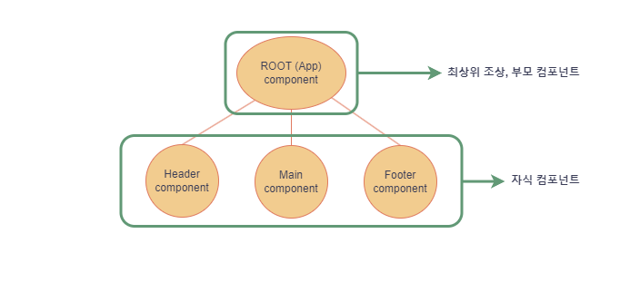

# React.js 입문

### VSCode Extension - ESlint 설치

ESLint는 자바스크립트 코드에서 발견되는 문제시되는 패턴들을 식별하기 위한 정적 코드 분석 도구이다.
[참고 링크 : ESlint 공식 홈페이지](https://eslint.org/)

<br><br>

## ch02. React Component

### React 컴포넌트란?

- JavaScript 함수에서 return 문에 html 태그들을 반환하는 함수를 말한다.

```jsx
// Header 컴포넌트
const Header = () => {
  return (
    <header>
      <h1>header</h1>
    </header>
  );
};
```

### 컴포넌트 생성방법

- 컴포넌트 이름은 대부분 해당 함수의 이름을 따서 부르며, 대문자로 시작해야 한다.
- 컴포넌트는 함수형 컴포넌트와 클래스형 컴포넌트 두가지 형태로 작성할 수 있다.
    
    → 클래스형 컴포넌트 사용시 작성해야하는 코드의 양이 많아지기 때문에 함수형 컴포넌트를 많이 사용한다.
    
- 함수형 컴포넌트는 function, 화살표 함수로 생성할 수 있다.

```jsx
// function을 사용한 컴포넌트
function Header() {
  return (
    <header>
      <h1>header</h1>
    </header>
  );
}

// 화살표 함수를 사용한 컴포넌트 
const Header = () => {
  return (
    <header>
      <h1>header</h1>
    </header>
  );
};
```

### 부모/자식 컴포넌트

- ROOT (App) 컴포넌트 : 최상위 조상 컴포넌트
- 자식 컴포넌트 : 본인의 컴포넌트가 다른 컴포넌트 return문에 포함된 컴포넌트
- 부모 컴포넌트 : 본인 컴포넌트 return문 내부에 다른 컴포넌트를 포함함


### 컴포넌트 모듈화

- Es 모듈 시스템에 의해 특정 컴포넌트를 `export` , `import` 하여 사용할 수 있다.
- vite로 생성한 React 프로젝트에서 import 시 확장자를 생략해도 인식이 가능하다. (vite 내부에 자동 설정되어 있음)

<br><br>

## ch03. JSX로 UI 표현하기

### JSX (JavaScript Extensions)

- 확장된 자바스크립트의 문법이며 React.js에서 JSX 문법을 사용한다.
- JavaScript와 Html을 혼용하여 사용할 수 있다.

### JSX 주의사항

1. JSX return 문의 중괄호 내부에는 자바스크립트 표현식만 넣을 수 있다.
    - 자바스크립트 표현식 : 한줄의 코드가 특정한 값으로 평가 될 수 있는 식
    - `if`, `for` 과 같은 조건문은 자바스크립트 표현식이 아니기 때문에 return 문에서 사용이 불가하다.
2. 숫자, 문자열, 배열 값만 렌더링 된다.
    - `boolean`, `undifined`, `null` 값은 화면에 렌더링이 불가하다.
    - `Objcet`(객체) 값은 렌더링이 불가하다. 점 표기법 `obj.a` 과 같이 객체의 프로퍼티를 꺼낸값이 문자나 숫자인 경우만 렌더링이 가능하다.
3. 모든 태그는 닫혀있어야 한다.
    - 태그를 사용시 `/`를 사용한 닫는 태그가 존재해야 한다.
4. 최상위 태그는 반드시 하나여야만 한다.
    - 최상위 태그에 사용할 만한 태그가 없는 경우 Fragment (= 빈 태그, `<> </>`) 를 사용해준다.
    
    ```jsx
    // 닫는 태그가 하나인 경우
    return (
    	<>
    		<h1>Hello</h1>
    	</>
    )
    
    // ERROR : 닫는 태그가 하나이상인 경우
    return (
    	<div></div>
    	<div>
    		<h1>Hello</h1>
    	</div>
    )
    ```
    

### React Fragment (= 빈 태그, `<> </>`)

- 컴포넌트가 여러 엘리먼트를 return 할때 JSX 규칙상 하나의 태그로 묶어서 return 해줘야 한다. 이때 Fragment 를 사용하면 DOM에 별도의 노드를 추가하지 않고 여러자식을 그룹화 할 수 있다.
- Fragment는 불필요한 DOM의 생성을 막기 때문에 메모리를 적게 사용한다.

[참고 링크 : **React docs**](https://ko.legacy.reactjs.org/docs/fragments.html)

### JSX에서 삼항연산자를 이용한 조건부 렌더링

```jsx
const Main = () => {
  const user = {
    namd: "user1",
    isLogin: true,
  };

// 방법 1
 if (user.isLogin) {
    return <div>로그아웃</div>;
  } else {
    return <div>로그인</div>;
  }
  
// 방법 2
  return <>{user.isLogin ? "로그아웃" : "로그인"}</>;

};

export default Main;
```

### JSX에서 DOM 요소에 style 적용하기

1. 요소에 style 직접 적용하기
    - html element에 style 적용시 케밥 케이스(kebab-case) 표기법 사용 `background-color`
        
        → JSX element에 style 적용시에는 카멜케이스(camelCase) 표기법 사용 `background-color`
        

```jsx
<div style={{ backgroundColor: "pink", border: "5px solid green" }}>
	로그아웃
</div>
```

1. 별도의 css 파일을 import 하여 사용하기
    - import +  css 파일 경로
    - element에 className 속성을 사용하여 css에 정의된 class를 사용
        - JSX는 html과 JavsScript를 같이 사용하기 때문에 , JavaScript의 예약어인 `class` 를 사용할 수 없다. 대신 `className` 을 사용하여 css에 정의된 class를 사용한다.

```jsx
// 컴포넌트
import "./Main.css";
...
<div className="logout">로그아웃</div>

// css 파일
.logout {
    background-color: pink;
    border: 5px solid green;
}
```
<br><br>

## ch04. props로 데이터 전달하기
### props 란?

- props는 property를 뜻하며 다른 컴포넌트에 값을 전달할 때 props를 사용한다.
- 컴포넌트에 전달되는 props는 파라미터를 통하여 값을 가져올 수 있다.
- props를 통해 주어진 값에 따라 각각 컴포넌트 별 렌더링이 가능하다.
- props는 자식컴포넌트 → 부모컴포넌트로만 전달할 수 있다.

### props 사용 방법

부모 컴포넌트에서 전달한 값을 자식컴포넌트에서 `props` 를 사용하여 값을 가져올 수 있다.

```jsx
// 부모 컴포넌트
const Main = () => {
  return (
    <>
    <Button text={"메일"} color={"red"}/><br />
    <Button text={"카페"} color={"blue"}/><br />
    <Button text={"블로그"} color={"green"}/><br />
    </>
  )
};

export default Main;

// 자식 컴포넌트
// props 사용법 1. props를 이용하여 전달한 값을 가져올 수 있다.
const Button = (props) => {
    return <button style={{props.color}}>{props.text}</button>
}

// props 사용법 2. 구조분해 할당을 이용하여 props를 가져올 수 있다.
const Button = ({text, color}) => {
    return <button style={{color}}>{text}</button>
}

export default Button;
```

### ~~defaultProps 설정하기~~ → Deprecate !

컴포넌트에 props를 지정하지 않았을 때 기본적으로 사용할 값이 설정되지 않은 상태에서 작업을 하면 문제가 발생할 수 있다.

이를 방지하기 위해 부모 컴포넌트에서 특정 props 값이 주어지지 않았을 때 자식 컴포넌트에서 기본적으로 사용할 props값을 `~~defaultProps~~`라고 한다.

```jsx
const Button = ({text, color}) => {
    return <button style={{color}}>{text} - {color.toUpperCase()}</button>
}

// ~~defaultProps~~ 를 사용하여 기본값을 설정
Button.~~defaultProps~~ = {
    color: "black",
}

export default Button;
```

### ~~defaultProps~~대신 default parameters 사용하기

React에서는 2019년부터 `defaultProps` 사용을 **Deprecate** 하였으며 React 18.2 버전에서 `defaultProps`를 사용하는 경우 Console 탭에 Warning 문구가 발생한다.

Warning 문구에서는 JavaScript의 **default parameters**를 사용하도록 권장한다.

[[🌍참고링크] JavaScript의 default parameters](https://developer.mozilla.org/en-US/docs/Web/JavaScript/Reference/Functions/Default_parameters#description)


`defaultProps` 대신 JavaScript의 **default parameters**를 사용하면 아래와 같이 코드를 작성할 수 있다.

```
const Button = ({text, color = "black"}) => {
    return <button style={{color}}>{text} - {color.toUpperCase()}</button>
}

export default Button;
```

### 여러개의 props를 전달해야 하는 경우

여러개의 props를 나열하는 경우 props가 많아질수록 코드가 복잡해 보일 수 있다.

이런경우 전달하는 컴포넌트에서 별도의 `props` 객체를 생성하고, 자식 컴포넌트에 `props` 전달시 스프레드 연산자를 이용하여 전달할 수 있다.

```jsx
// 부모 컴포넌트
import Button from "./Button";
import "./Main.css";
const Main = () => {
  // * 전달할 props 객체 *
  const buttonProps = {
    text: "메일",
    color: "pink",
    a: 1,
    b: 2,
    c: 3
  }

  return (
    <>
    // * props 객체 전달시 spread 연산자를 사용하여 전달 *
    <Button {...buttonProps}/><br />
    <Button text={"카페"} color={"blue"}/><br />
    <Button text={"블로그"} color={"green"}/><br />
    </>
  )
};

export default Main;

// 자식 컴포넌트
// default parameters를 사용하여 기본값을 세팅
const Button = ({text, color = "black", a = 0, b = 0, c = 0}) => {
    return <button style={{color}}>{text} - {color.toUpperCase()} - {[a,b,c]}</button>
}

export default Button;

```

### props에 전달할 수 있는 값들

JavaScript의 값들뿐만 아니라 HTML의 element, React 컴포넌트도 전달이 가능하다.

### props에 element 전달하기

```jsx
// 부모 컴포넌트
...
// 컴포넌트 태그 사이에 전달할 element 태그를 작성
<Button text={"자식요소"}>
   <div>전달할 자식 Element</div>
</Button>
...

// 자식 컴포넌트
// children을 사용하여 부모에서 전달한 element 값을 반환받는다.
const Button = ({text, color = "black", a = 0, b = 0, c = 0, children = null}) => {
    return (
	    <button style={{color}}>
	        {text} - {color.toUpperCase()} - {[a,b,c]} 
	        {children}
	    </button>
    )
}
...
```

### props에 컴포넌트 전달하기

```jsx
// 부모 컴포넌트
...
// 컴포넌트 태그 사이에 전달할 컴포넌트 태그를 작성
<Button text={"자식요소"}>
   <Header />
</Button>
...

// 자식 컴포넌트
// children을 사용하여 부모에서 전달한 컴포넌트를 반환받는다.
const Button = ({text, color = "black", a = 0, b = 0, c = 0, children = null}) => {
    return (
	    <button style={{color}}>
	        {text} - {color.toUpperCase()} - {[a,b,c]} 
	        {children}
	    </button>
    )
}
...
```