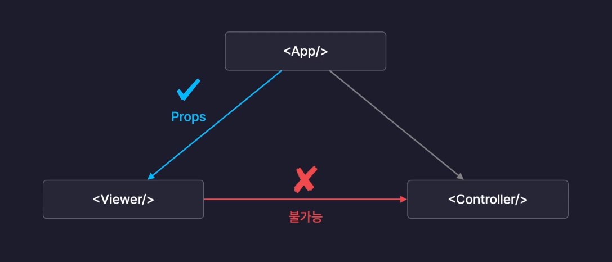
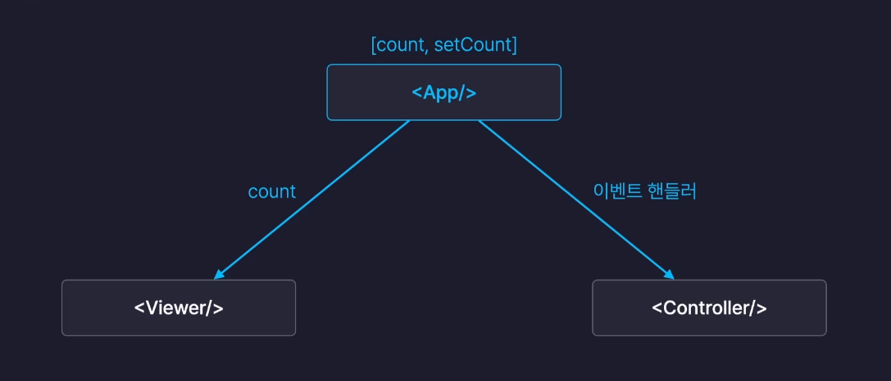
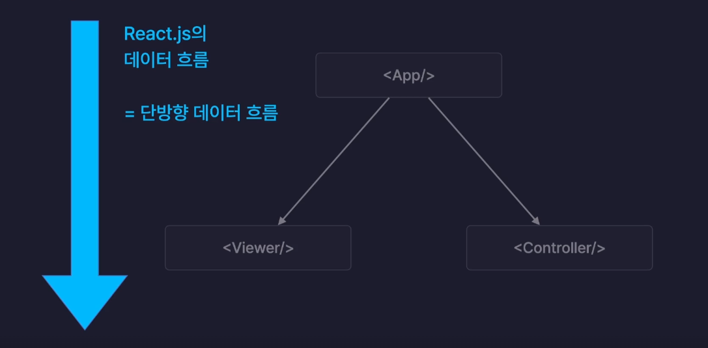

# section06. 카운터 앱 프로젝트

React에서 화면을 구성시 부모 - 자식 관계를 이루며 계층구조를 형성한다.

React에서 특정 컴포넌트가 다른 컴포넌트에게 데이터를 전달하려면 두 컴포넌트는 부모자식 관계를 가지고 있어야 한다.

하나의 State를 여러 컴포넌트에서 사용해야하는 경우 State 변수는 사용될 컴포넌트들의 공통 부모가 되는곳에 만들어 사용해야 한다.

 

## State Lifting (State 끌어올리기)

State 를 계층 구조상 위로 끌어올려서 하위에 있는 컴포넌트들이 공유할 수 있도록 만드는 방법

 

## React의 단방향 데이터 흐름

React에서는 props 라는 기능을 사용하여 부모에서 자식 방향으로만 데이터를 전달할 수 있다.

그렇기 때문에 데이터는 위에서 아래의 방향으로 흐른다.

이러한 데이터 흐름을 **단방향 데이터 흐름** 이라고 부른다.

단방향 데이터 흐름은 데이터의 흐름을 파악하기 쉽고 직관적으로 관리할 수 있는 장점이 있다.

애플리케이션 개발시 단방향 데이터 흐름을 고려하여 데이터의 원천인 State를 어떤 컴포넌트에 위치시킬지 고려해야한다.