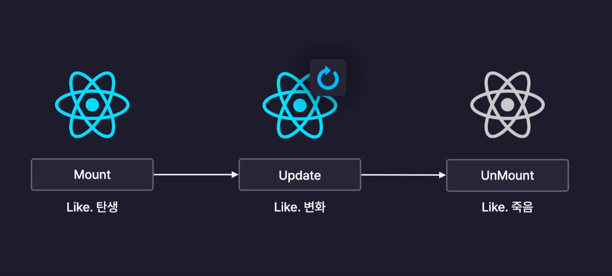
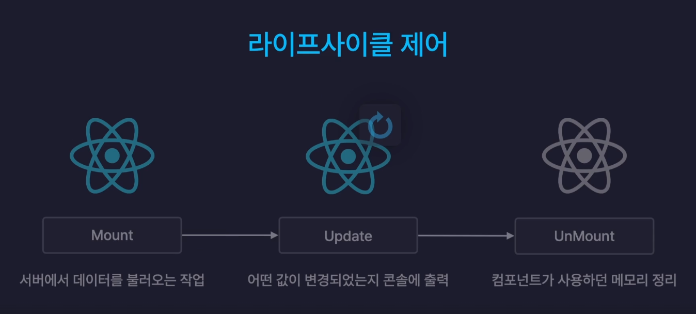

# section07. 라이프사이클

## ch01. 라이프사이클(Life Cycle)

라이프사이클이란 생애주기를 말한다.

탄생부터 죽음까지의 라이프사이클 처럼 React 컴포넌트에도 라이프사이클이 존재한다.

## React 컴포넌트의 라이프사이클

React 컴포넌트는 Mount , Update, UnMount의 3가지 단계의 라이프사이클을 갖는다.


### 1. Mount (= 탄생)

- 컴포넌트가 최초로 렌더링 되는 순간
- 화면에 처음 렌더링 되는 순간

### 2. Update (= 변화)

- 컴포넌트가 다시 렌더링 되는 순간
- 리렌더링 될 때를 의미

### 3. UnMount (= 죽음)

- 컴포넌트가 화면에서 사라지는 순간
- 컴포넌트가 렌더링에서 제외되는 순간

### React 라이프사이클 제어

컴포넌트의 라이프사이클 단계 별로 특정 작업을 수행하도록 하는것을 **라이프사이클 제어** 라고 부른다.

React의 라이프사이클 제어는 useEffect 훅을 이용하여 수행할 수 있다.


<br><br>

## ch02. useEffect 사용하기
### useEffect Hook

React Component의 **사이드 이펙트**를 제어하는 새로운 React Hook

컴포넌트가 렌더링 될 때 특정 조건에 의존하여 수행된다.

### React Component의 사이드 이펙트(Side Effect)

컴포넌트의 동작에 따라 발생하는/파생되는 여러 효과

컴포넌트의 값 변경을 감지하여 특정 코드를 실행하거나, 라이프 사이클 제어하는 등 useEffect를 사용하여 React Component의 사이드 이펙트(Side Effect)를 제어할 수 있다.


### useEffect를 사용하기여 값 변경 감지하기

- useEffect의 첫번째 인수로는 수행할 콜백 함수를 넣어주고, 두번째 인수로는 배열을 넣어준다.
- useEffect는 두번째 인수의 배열 내부에 담겨있는 값이 변경되는 경우, 첫번째 인수에 담긴 콜백함수를 실행한다. 결국 useEffect Hook은 두번째 배열에 담긴 값에 의해 다르게 동작한다.
    
    → useEffect에 두번째 인수의 배열을 **의존성 배열(dependency array = deps)**이라 한다.
    

```jsx
// useEffect (() => {}, [])
// 첫번째 인수는 수행할 콜백 함수, 두번째 인수는 의존성 배열이 담긴다.
useEffect(() => {
    // 의존성 배열의 값이 변경되는 경우 실행되는 함수
  console.log(`count : ${count} / input : ${input}`);
}, [count, input]); // count 와 input 값이 변경되면 useEffect의 함수가 실행된다.
```

### useState 값 변경시 useEffect를 사용해야 하는 이유

useState 객체값을 변경하는 setState 함수는 비동기로 동작한다.

일반적인 함수에서 setState 함수 호출 후 state 값을 사용하면 변경하려는 값이 업데이트가 완료되지 않아 이전의 state값으로 작업이 진행되는 문제가 발생할 수 있다.

useEffect에서 useState 객체값을 변경을 감지하여 useState 객체값이 완전히 변경 된 이후 사이드 이펙트에 해당하는 부가적인 작업을 실행해야 한다.


<br><br>

## ch03. useEffect로 라이프사이클 제어하기
### Mount

컴포넌트 최초 렌더링시 useEffect를 사용하여 작업 수행

```jsx
function App() {
...
  // useEffect
  // 1. mount : 컴포넌트가 렌더링 되는 시점
  useEffect(() => { 
    console.log('mount!');
  }, [])
...
```

### Update

컴포넌트 변경시 useEffect를 사용하여 작업 수행

```jsx
function App() {
...
	// 2. update : 컴포넌트가 변경되는 시점
  useEffect(() => {
    // 컴포넌트 mount시에 useEffect를 수행하고 싶지 않은 경우 ref 객체를 플래그로 사용하여 함수를 수행하지 않도록 한다.
    if(!isMount.current){
      // 컴포넌트가 mount 되지 않은 상황
      isMount.current = true;
      console.log('isMount.current --> set true!');
      return;
    }
    // 컴포넌트가 mount 된 이후 update 된 상황
    console.log('updated!');
  })
...
```

### UnMount

컴포넌트 렌더링 종료시  useEffect의 콜백함수가 반환하는 함수(클린업, 정리함수) 실행

```jsx
// App.jsx
function App() {
...
 return (
			...
			<section>
        <Viewer count={count} />
        {/* count 가 짝수인 경우만 Even 컴포넌트 출력 */}
        {(count % 2 === 0) ? <Even /> : null}
      </section>
      ...
      
// Even.jsx
import { useEffect } from "react"

const Even = () => {
    
  // 3.unMount : 컴포넌트 렌더링이 종료되는 시점
    useEffect(() => {
        // useEffect의 콜백함수가 반환하는 함수 : 클린업, 정리함수 라고 부른다.
        // useEffect가 unMount(종료)될 때 실행된다.
        return () => {
            console.log("unMount");
        }
    }, [])
  return (
    <div>짝수입니다!</div>
  )
}

export default Even;
```