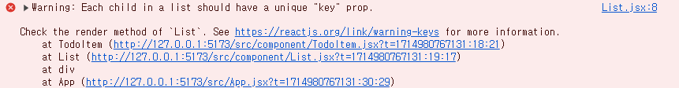

# section08. 투두리스트 프로젝트

## ch04. Create - 투두 추가하기

App.jsx

1. todo 추가 함수 `onCreate`생성 후 Editor 컴포넌트로 전달
2. Editor 컴포넌트에서 추가버튼 클릭시 `onCreate` 함수 호출
    
    `onCreate` 함수 호출시
    
    1. content 값이 입력되지 않은 경우 알림창 출력 + content 입력창에 focus
    2. content 값이 입력된 경우 `onCreate` 함수 호출 + content 값 초기화

```jsx
// 임시데이터
// App 컴포넌트가 리렌더링 될 때마다 다시 생성될 필요가 없고, 
// 상수이기 때문에 값을 변경할수도 없으니 컴포넌트 외부에 선언해주어도 된다.
const mockData = [
  { id: 0, isDone: false, content: "공부하기", date: new Date().getTime() },
  { id: 1, isDone: false, content: "빨래하기", date: new Date().getTime() },
  { id: 2, isDone: false, content: "짐정리하기", date: new Date().getTime() },
];

function App() {
  const [todos, setTodos] = useState(mockData);
  const idRef = useRef(3);

  // todos 에 새로운 todo 추가하기
  const onCreate = (content) => {
    // todos 배열에 추가할 새 todo 객체 생성
    const newTodo = {
      // idRef 를 사용해 다음 id 값을 가져온다.
      id: idRef.current ++,
      isDone:false,
      content: content,
      date: new Date().getTime()
    }

    // setTodos를 사용해 추가할 데이터를 맨 앞으로 오도록 todos를 업데이트 한다.
    setTodos([
      newTodo,
      ...todos,
    ])
  }

  return (
    <div className="App">
      <Header />
      <Editor onCreate={onCreate}/>
      <List />
    </div>
  );
}
```

Editor.jsx

```jsx
const Editor = ({onCreate}) => {
  const [content, setContent] = useState(""); // input 객체 값 저장을 위한 useState
  const contentRef = useRef();  // input 객체 포커싱을 위한 useRef

  // content 입력값 변경시 값 업데이트
  const onChangeContent = (e) => {
    setContent(e.target.value);
  }

  // 추가 버튼 클릭시 onCreate 실행
  const onSubmit = () => {
    // content 값이 입력되지 않은 경우
    if(content === ""){
      alert('추가할 To-do를 입력해주세요');  // 알림창 출력
      contentRef.current.focus();  // content 입력창에 focus
      return;
    }
    // content 값이 입력된 경우
    onCreate(content);  // todos에 객체 값 추가
    setContent("");    // content 값 초기화
  }

  // enter 키 입력시 onSubmit 함수 실행
  const onKeyDown = (e) => {
    // e.keyCode === 13 (= Enter 키)
    if(e.keyCode === 13) {
      onSubmit();
    }
  }

  return (
    <div className="Editor">
      <input 
        value={content}
        onKeyDown={onKeyDown}
        onChange={onChangeContent}
        ref={contentRef}
        placeholder="새로운 To-do..."
      />
      <button
        onClick={onSubmit}
      >
        추가
      </button>
    </div>
  );
};

export default Editor;
```


<br><br>

## ch05. Read - 투두리스트 렌더링하기

Key는 React가 어떤 항목을 변경, 추가 또는 삭제할지 식별하는 것을 돕는다.<br>
key는 엘리먼트에 안정적인 고유성을 부여하기 위해 배열 내부의 엘리먼트에 지정해야 한다.

[[🌍 React 공식문서] 리스트와 Key](https://ko.legacy.reactjs.org/docs/lists-and-keys.html#keys)

```jsx
{todos?.map((todo) => {
    // Warning: Each child in a list should have a unique "key" prop.
    // return <TodoItem {...todo}/> // 
    
    // key 추가시 경고 사라짐
    return <TodoItem key={todo.id} {...todo}/>  
})}
```

### 검색값 필터링 하여 렌더링 하기

1. 검색어 입력용 useState 추가
2. input 값 저장용 onChangeSearch 함수 생성
3. input 값 변경시 todos 필터링 함수 생성
4. 필터링된 todos 데이터 리턴
5. 필터링된 데이터 반복하여 출력

```jsx
// List.jsx
import { useState } from "react";
import "./List.css";
import TodoItem from "./TodoItem";
const List = ({ todos }) => {
  // 검색어 입력을 위한 useState
  const [search, setSearch] = useState("");

  // input 값 저장용 onChangeSearch 
  const onChangeSearch = (e) => {
    setSearch(e.target.value);
  };

  // input 값 변경시 todos 필터링 함수
  const getFilteredData = () => {
    // 검색 값이 없는 경우 todos 리턴
    if (search === "") {
      return todos;
    }
    // 검색 값이 있는 경우 필터링
    return todos.filter((todo) =>
      // 대소문자 구분 없이 검색어 입력
      todo.content.toLowerCase().includes(search.toLowerCase())
    );
  };

  // 필터링된 todos 데이터 리턴
  const filterdTodos = getFilteredData();
  
  return (
    <div className="List">
      <h4>To-Do List 🌷</h4>
      <input
        value={search}
        onChange={onChangeSearch}
        placeholder="검색어를 입력하세요"
        />
      <div className="todos_wrapper">
        {/* 필터링된 todos 데이터 반복하여 렌더링 */}
        {filterdTodos.map((todo) => {
          return <TodoItem key={todo.id} {...todo} />;
        })}
      </div>
    </div>
  );
};

export default List;

```

## ch06. Update - 투두 수정하기

To-Do list의 체크박스 클릭시 체크박스가 변경되도록 수정하기

1. App.jsx 에 todos의 값들 중 일치하는 id를 가진 todo 아이템의 isDone 프로퍼티를 변경하는 `onUpdateIsDone` 함수 생성

```jsx
// todos State 값들 중 targetId와 일치하는 id를 갖는 todo 아이템의 isDone 프로퍼티 변경
  const onUpdateIsDone = (targetId) => {
    // 인수 : todos의 배열중 id 와 일치하는 targetId
    setTodos(
      // todos 를 순회하며 todo.id 와 targetId 가 일치하는 경우에만 isDone의 값을 업데이트 한다.
      todos.map((todo) => todo.id === targetId ? {...todo, isDone: !todo.isDone} : todo)
    )
  }
```

1. App.jsx → List.jsx → TodoItem.jsx 컴포넌트로 `onUpdateIsDone`함수 전달

```jsx
// List.jsx
const List = ({ todos, onUpdateIsDone }) => {
...
{filterdTodos.map((todo) => {
    return <TodoItem key={todo.id} {...todo} onUpdateIsDone={onUpdateIsDone}/>;
})}
```

1. TodoItem.jsx의 input 태그에 onChage 함수 생성하여 전달한 `onUpdateIsDone`함수 호출

```jsx
import "./TodoItem.css";
const TodoItem = ({ id, isDone, content, date, onUpdateIsDone }) => {
  // input 태그의 checkbox 클릭시 실행될 함수
  const onChangeCheck = () => {
    // 전달받은 함수 실행
    onUpdateIsDone(id);
  };

  return (
    <div className="TodoItem">
      <input checked={isDone} onChange={onChangeCheck} type="checkbox" />
      <div className="content">{content}</div>
      <div className="date">{new Date(date).toLocaleDateString()}</div>
      <button>삭제</button>
    </div>
  );
};

export default TodoItem;

```

## ch07. Delete - 투두 삭제하기

To-Do list의 삭제버튼 클릭시 해당 To-Do 삭제하기

1. App.jsx에 To-do 삭제하는 `onDeleteTodo`함수 생성

```jsx
// todos State 값들 중 targetId와 일치하는 id를 갖는 todo 아이템을 제외한 배열 객체 반환
  const onDeleteTodo = (targetId) => {
    // 인수 : todos의 배열중 id 와 일치하는 targetId
    setTodos(
      // 배열 내부의 모든 todo를 순회하며 todo.id 와 targetId 가 일치하지 않는 todo만 반환
      todos.filter((todo) => todo.id !== targetId)
    );
  }
```

1. App.jsx → List.jsx → TodoItem.jsx 컴포넌트로 `onDeleteTodo`함수 전달

```jsx
const List = ({ todos, onUpdateIsDone, onDeleteTodo }) => {
...
{filterdTodos.map((todo) => {
          return (
            <TodoItem
              key={todo.id}
              {...todo}
              onUpdateIsDone={onUpdateIsDone}
              onDeleteTodo={onDeleteTodo}
            />
          );
        })}
```

1. TodoItem.jsx에서 삭제버튼 클릭시 전달한  `onDeleteTodo`함수 호출

```jsx
// TodoItem.jsx
const TodoItem = ({ id, isDone, content, date, onUpdateIsDone, onDeleteTodo }) => {
...
  // 삭제버튼 클릭시 실행될 함수
  const handleDeleteButton = () => {
    // 전달받은 함수 실행
    onDeleteTodo(id);
  }
...
return (
...
  <button onClick={handleDeleteButton}>삭제</button>
```