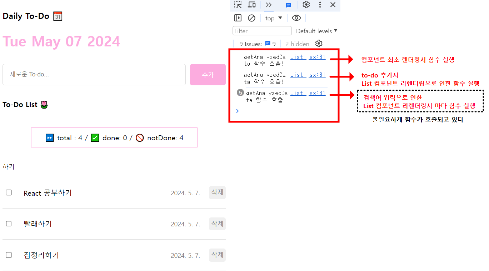
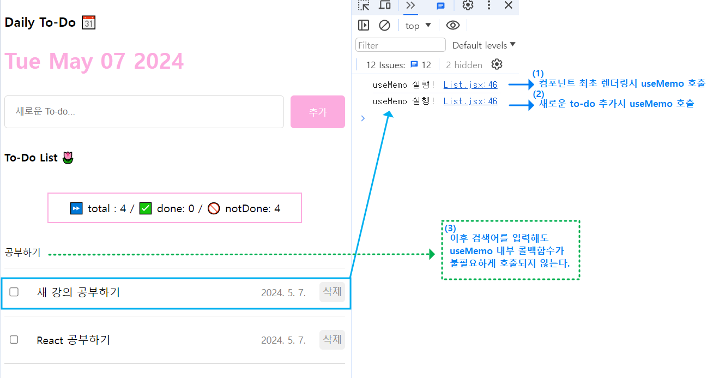

# section10. 최적화

## ch01. 최적화(Optimization)

웹 서비스의 성능을 개선하는 모든 행위

단순한것부터 아주 어려운 방법까지 매우 다양함

### 일반적인 웹 서비스 최적화 방법

- 서버의 응답속도 개선
- 이미지, 폰트, 코드 파일 등의 정적 파일 로딩 개선
- 불필요한 네트워크 요청 줄임

### React App 내부의 최적화 방법

- 컴포넌트 내부의 불 필요한 연산 방지
- 컴포넌트 내부의 불 필요한 함수 재생성 방지
- 컴포넌트의 불 필요한 리렌더링 방지

<br><br>

## ch02. useMemo와 연산 최적화

### useMemo

**메모이제이션(Memoization : 기억해두기, 메모해두기) 기법**을 기반으로 불 필요한 연산을 최적화 하는 React Hook

(자매품으로 useCallback이 있다.)

### useMemo 사용법

```jsx
const value = useMemo(() => {},[])
```

- useMemo는 첫번째 인자로 실행할 콜백함수, 두번째 인자로 의존성 배열을 받는다.
- useEffect와 같이 의존성 배열의 값이 변경되는 경우에만 첫번째 인자의 콜백함수가 수행된다.


### useMemo 사용 전


```jsx
// List.jsx
// todos 변경시마다 todos의 총 개수, 완료 개수, 미완료 개수를 계산하는 함수 
const getAnalyzedData = () => {
  console.log('getAnalyzedData 함수 호출!');
    const totalCount = todos.length;
    const doneCount = todos.filter((todo) => todo.isDone).length;
    const notDoneCount = totalCount - doneCount;
  
    return {
      totalCount,
        doneCount,
        notDoneCount,
      };
    };
    
 const { totalCount, doneCount, notDoneCount } = getAnalyzedData();
...
return (
  <div className="Analyze">⏩ total : {totalCount} / ✅ done: {doneCount} / 🚫 notDone: {notDoneCount}</div>
```
### useMemo 사용하여 컴포넌트 연산 최적화


```jsx
// useMemo의 콜백함수에 getAnalyzedData에서 수행하던 작업을 옮겨줌
const { totalCount, doneCount, notDoneCount } = useMemo(() => {
    console.log("useMemo 실행!");
    const totalCount = todos.length;
    const doneCount = todos.filter((todo) => todo.isDone).length;
    const notDoneCount = totalCount - doneCount;

    return {
      totalCount,
      doneCount,
      notDoneCount,
    };
  }, [todos]);
// 의존성 배열(deps)에 todos를 넣어줌으로써,
// todos가 변경되는 경우만 useMemo가 수행된다.
```
