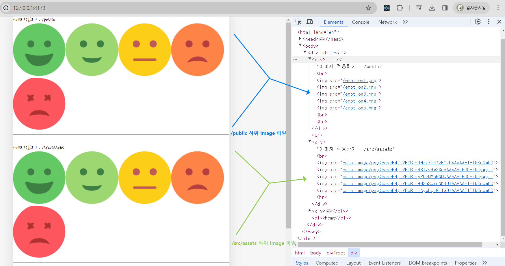
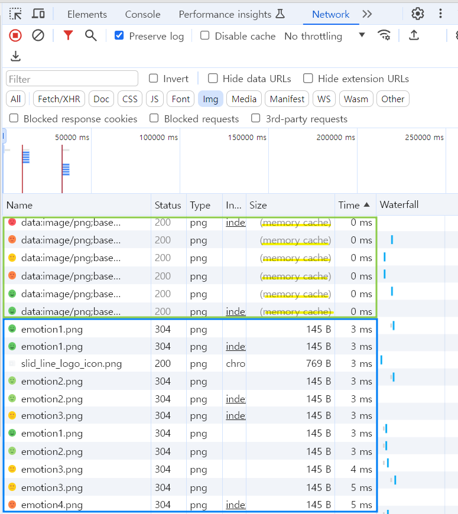

# section12. 감정 일기장 프로젝트
## ch02. 페이지라우팅✏

경로에 따라 알맞은 페이지를 렌더링 하는 과정

### MPA(Multi Page Application)

애초에 서버는 여러개의 페이지를 가지고 있으며, 사용자의 요청에 따라 페이지를 반환해준다

동작방식이 직관적이기 때문에 많은 서비스가 사용하는 전통적인 방식이다

### 서버 사이드 렌더링(Server Side Rendering)

= 서버측에서 페이지를 렌더링 해준다

서버에서 이미 만들어져 있는 페이지를 브라우저가 전달받아 그대로 렌더링 하는방식

### MPA와 서버 사이드 렌더링의 차이

MPA : 단순히 서버가 Html을 여러개 갖고 있는것

서버 사이드 렌더링 : 브라우저가 서버에게 페이지 요청시 

### SPA✏

### 클라이언트 사이드 렌더링✏

### MPA 와 SPA✏

<br>

## ch03. 페이지라우팅 설정하기✏

### React Router✏

### React Router 설치하기

```jsx
npm i react-router-dom
```

### React Router 사용하여 컴포넌트 이동하기✏

### path가 명시 되지 않은 페이지로 접속하려는 경우 띄울 컴포넌트 설정하기✏

### React Router 사용시 주의사항

1. Routes 컴포넌트 내부에는 일반 element를 사용할 수 없다.

2. Routes 컴포넌트 외부에 일반 element를 사용시 페이지 라우팅과 관계 없이 모든 페이지에 렌더링 된다.
    
    → Routes 컴포넌트 내부의 요소들만 페이지 렌더링시 마다 바뀌는 것이고 그 외 요소들은 일반 React 컴포넌트 처럼 렌더링이 진행된다.
    
    → 따라서 모든 페이지에 공통적으로 적용되지 않는다면 Routes 컴포넌트 바깥에 배치되는것은 적절하지 않다.
    
<br>


## ch04. 페이지 라우팅 - 페이지 이동

### <Link> 를 통해 이동하기

Link 컴포넌트

- html a 태그를 대체하는 컴포넌트
- to 속성을 이용하여 이동할 링크를 명시한다.
- Link를 사용하여 페이지 이동시 클라이언트 사이드 렌더링이 가능하다. 페이지 전체가 리로딩(새로고침) 되지 않고 페이지를 이동하는 것을 확인할 수 있다.

### <Link> 가 아닌 <a> 태그를 통해 페이지를 이동하는 경우✏

### 특정 이벤트 발생시 페이지를 이동하는 방법

React Router 의 useNavigate 커스텀 Hook 사용

useNavigate

- 페이지를 실제로 이동시키는 navigate 객체를 반환한다.
- 객체의 인수로는 이동하고자 하는 (Route 태그에 명시한) path를 넣어주면 된다.
 
<br>

## ch05. 페이지 라우팅 - 동적 경로

### 동적 경로(Dynamic Segments)

동적인 데이터를 포함하고 있는 경로


### URL Parameter / Query String


### URL Parameter 적용하기

```jsx
import { useParams } from "react-router-dom";
// http://127.0.0.1:5173/diary/100  --> 페이지로 이동시
const Diary = () => {
  const params = useParams();
  console.log(params);   // {id: '100'}

  return <div>
    <h3>Diary</h3>
    {params.id}번 일기
    </div>;
};

export default Diary;

```

### Query String 적용하기

```jsx
import { useSearchParams } from "react-router-dom";

const New = () => {
  const [params, setParams] = useSearchParams();  // Router로 Query String 사용하기
  console.log('New --> ' ,params.get("value"));  // params로 전달한 값 꺼내기

  return (
    <div>New : {params.get("value")}</div>
  )
}

export default New
```

### 폰트 적용하기

1. 적용할 폰트를 프로젝트/public 폴더로 옮겨준다.
2. 프로젝트/src/index.css 파일에 폰트 적용을 위한 css 코드를 작성해준다.
3. App.jsx에 index.css 파일 적용을 위해 import 해준다.

### 이미지를 적용하는 방법

1. 이미지가 public 폴더에 위치한 경우

```jsx
function App() {
	return(
		<div>
      이미지 적용하기 : /public<br/>
        
        
        
        
        
        <br />
        <hr />
	</div>
)}
```

<br>

## ch06. 폰트, 이미지, 레이아웃 설정하기

1. 이미지가 src/assets 폴더에 위치한 경우

```jsx
import emotion1 from "./assets/emotion1.png";
import emotion2 from "./assets/emotion2.png";
import emotion3 from "./assets/emotion3.png";
import emotion4 from "./assets/emotion4.png";
import emotion5 from "./assets/emotion5.png";

function App() {
	return(
		<div>
      이미지 적용하기 : /src/assets
        <br />
        
        
        
        
        
        <hr />
    </div>
  );
}
```

<br>

### 이미지 최적화

배포 후 프로젝트에서 이미지가 렌더링 되는 부분을 확인해보면 차이점이 존재한다.

/public 의 이미지를 렌더링 하는 경우 src 경로명이 img 파일의 위치로 잡혀있지만, /src/assets의 이미지를 렌더링 하는 경우 내가 지정하지 않은 경로로 잡혀있다.

위와같은 경로를 `DATA URI` 라고 하며 이미지 같은 데이터를 불러올 때 브라우저의 메모리에 데이터를 캐싱하여 새로고침하여도 데이터를 다시 불러오지 않도록 최적화가 된다.


개발자 도구의 network 탭에서 확인해보면 일반 경로에서 불러온 이미지는 페이지가 렌더링 될 때마다 새로 데이터를 가져오고 있는걸 확인 할 수 있다.

DATA URI 로 불러온 데이터는 memory cache 라고 적혀있으며 페이지 렌더링시 마다 새로 데이터를 불러오는것이 아닌 cache 된 데이터를 가져오고 있는것을 알 수 있다. 

한번 불러온 이미지를 다시 불러오지 않기 위해 이미지를 최적화 하기 위해서는 코드상에서 import 문을 사용하여 cache 된 데이터를 가져오도록 해야 한다.

하지만 불러와야 하는 이미지가 많은 경우 모든 데이터를 캐싱하여 저장하는것이 성능을 저하시킬 수 있기 때문에 이런 경우에는 경로에서 이미지를 가져오는 방식이 적합할 수 있다.

데이터를 가져오는 방식은 상황에 맞게 최적화 해야 한다.

<br>

### 이미지를 불러오는 별도의 모듈 생성하기

```jsx
// get-emotion-image.js
import emotion1 from "./../assets/emotion1.png";
import emotion2 from "./../assets/emotion2.png";
import emotion3 from "./../assets/emotion3.png";
import emotion4 from "./../assets/emotion4.png";
import emotion5 from "./../assets/emotion5.png";

// 이미지 번호를 기준으로 이미지를 반환하는 함수
export function getEmotionImage(emotionId) {
  switch (emotionId) {
    case 1:
      return emotion1;
    case 2:
      return emotion2;
    case 3:
      return emotion3;
    case 4:
      return emotion4;
    case 5:
      return emotion5;
    default:
      return null;
  }
}

// App.jsx
        
        
        
        
        
```