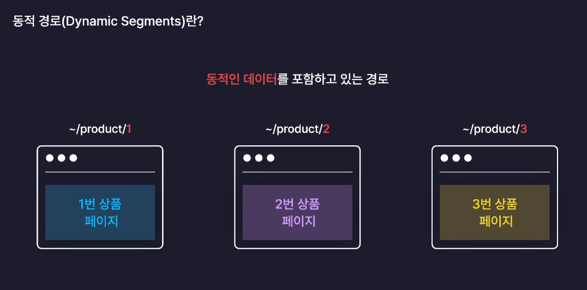
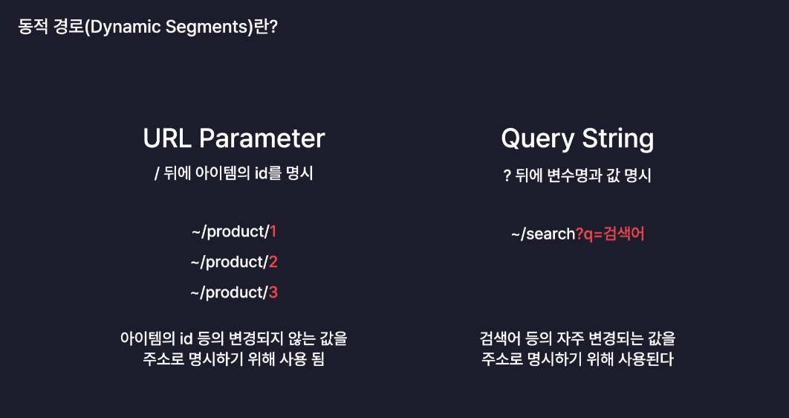

# section12. 감정 일기장 프로젝트
## ch02. 페이지라우팅✏

경로에 따라 알맞은 페이지를 렌더링 하는 과정

### MPA(Multi Page Application)

애초에 서버는 여러개의 페이지를 가지고 있으며, 사용자의 요청에 따라 페이지를 반환해준다

동작방식이 직관적이기 때문에 많은 서비스가 사용하는 전통적인 방식이다

### 서버 사이드 렌더링(Server Side Rendering)

= 서버측에서 페이지를 렌더링 해준다

서버에서 이미 만들어져 있는 페이지를 브라우저가 전달받아 그대로 렌더링 하는방식

### MPA와 서버 사이드 렌더링의 차이

MPA : 단순히 서버가 Html을 여러개 갖고 있는것

서버 사이드 렌더링 : 브라우저가 서버에게 페이지 요청시 

### SPA✏

### 클라이언트 사이드 렌더링✏

### MPA 와 SPA✏

<br>

## ch03. 페이지라우팅 설정하기✏

### React Router✏

### React Router 설치하기

```jsx
npm i react-router-dom
```

### React Router 사용하여 컴포넌트 이동하기✏

### path가 명시 되지 않은 페이지로 접속하려는 경우 띄울 컴포넌트 설정하기✏

### React Router 사용시 주의사항

1. Routes 컴포넌트 내부에는 일반 element를 사용할 수 없다.

2. Routes 컴포넌트 외부에 일반 element를 사용시 페이지 라우팅과 관계 없이 모든 페이지에 렌더링 된다.
    
    → Routes 컴포넌트 내부의 요소들만 페이지 렌더링시 마다 바뀌는 것이고 그 외 요소들은 일반 React 컴포넌트 처럼 렌더링이 진행된다.
    
    → 따라서 모든 페이지에 공통적으로 적용되지 않는다면 Routes 컴포넌트 바깥에 배치되는것은 적절하지 않다.
    
<br>


## ch04. 페이지 라우팅 - 페이지 이동

### <Link> 를 통해 이동하기

Link 컴포넌트

- html a 태그를 대체하는 컴포넌트
- to 속성을 이용하여 이동할 링크를 명시한다.
- Link를 사용하여 페이지 이동시 클라이언트 사이드 렌더링이 가능하다. 페이지 전체가 리로딩(새로고침) 되지 않고 페이지를 이동하는 것을 확인할 수 있다.

### <Link> 가 아닌 <a> 태그를 통해 페이지를 이동하는 경우✏

### 특정 이벤트 발생시 페이지를 이동하는 방법

React Router 의 useNavigate 커스텀 Hook 사용

useNavigate

- 페이지를 실제로 이동시키는 navigate 객체를 반환한다.
- 객체의 인수로는 이동하고자 하는 (Route 태그에 명시한) path를 넣어주면 된다.
 
<br>

## ch05. 페이지 라우팅 - 동적 경로

### 동적 경로(Dynamic Segments)

동적인 데이터를 포함하고 있는 경로


### URL Parameter / Query String


### URL Parameter 적용하기

```jsx
import { useParams } from "react-router-dom";
// http://127.0.0.1:5173/diary/100  --> 페이지로 이동시
const Diary = () => {
  const params = useParams();
  console.log(params);   // {id: '100'}

  return <div>
    <h3>Diary</h3>
    {params.id}번 일기
    </div>;
};

export default Diary;

```

### Query String 적용하기

```jsx
import { useSearchParams } from "react-router-dom";

const New = () => {
  const [params, setParams] = useSearchParams();  // Router로 Query String 사용하기
  console.log('New --> ' ,params.get("value"));  // params로 전달한 값 꺼내기

  return (
    <div>New : {params.get("value")}</div>
  )
}

export default New
```